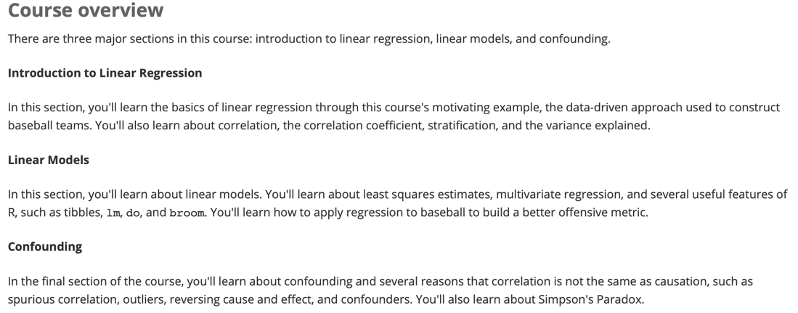

```{r setup, include=FALSE}
knitr::opts_chunk$set(echo = TRUE)
```

Linear regression is commonly used to quantify the relationship between two or more variables. It is also used to adjust for confounding. In this course, we cover how to implement linear regression and adjust for confounding in practice using R.

The class notes for this course series can be found in Professor Irizarry's freely available 
<a href="https://rafalab.github.io/dsbook/" title="Introduction to Data Science">Introduction to Data Science book.</a>

**Course overview**

There are three major sections in this course: introduction to linear regression, linear models, and
confounding.

**1. Introduction to Linear Regression**

In this section, you'll learn the basics of linear regression through this course's motivating example,
the data-driven approach used to construct baseball teams. You'll also learn about correlation, the 
correlation coefficient, stratification, and the variance explained.

**2. Linear Models**

In this section, you'll learn about linear models. You'll learn about least squares estimates, 
multivariate regression, and several useful features of R, such as tibbles, lm, do, and broom. You'll 
learn how to apply regression to baseball to build a better offensive metric.

**3. Confounding**

In the final section of the course, you'll learn about confounding and several reasons that correlation 
is not the same as causation, such as spurious correlation, outliers, reversing cause and effect, and 
confounders. You'll also learn about Simpson's Paradox.

---

# 1. Introduction to Linear Regression
In the **Introduction to Regression section**, you will learn the basics of linear regression.

After completing this section, you will be able to:

* Understand how Galton developed **linear regression**.
* Calculate and interpret the **sample correlation**.
* **Stratify** a dataset when appropriate.
* Understand what a **bivariate normal distribution** is.
* Explain what the term **variance explained** means.
* Interpret the two **regression lines**.

This section has three parts: **Baseball as a Motivating Example, Correlation**, and **Stratification and Variance Explained**. There are comprehension checks that follow most videos.

## 1.1Baseball as a Motivating Example

### 1.1.1 Motivating Example: Moneyball
As motivation for this course, we'll go back to 2002 and try to build a baseball team with a limited 
budget. Note that in 2002, the Yankees payroll was almost \$ 130 million, and had more than tripled the 
Oakland A's \$ 40 million budget. Statistics have been used in baseball since its beginnings. Note that 
the data set we will be using, included in the **Lahman Library**, goes back to the 19th century. 
For example, a summary of statistics we will describe soon, the batting average, has been used to 
summarize a batter's success for decades. Other statistics such as home runs, runs batted in, and stolen 
bases, we'll describe all this soon, are reported for each player in the game summaries included in the 
sports section of newspapers. And players are rewarded for high numbers. 
Although summary statistics were widely used in baseball, data analysis per se was not. These statistics 
were arbitrarily decided on without much thought as to whether they actually predicted, or were related 
to helping a team win. This all changed with Bill James. In the late 1970s, this aspiring writer and 
baseball fan started publishing articles describing more in-depth analysis of baseball data. He named 
the approach of using data to predict what outcomes best predict if a team wins **sabermetrics**. 
Until Billy Beane made sabermetrics the  center of his baseball operations, Bill James' work was mostly 
ignored by the baseball world. Today,  pretty much every team uses the approach, and it has gone beyond 
baseball into other sports. In this course, to simplify the example we use, we'll focus on predicting 
scoring runs. We will ignore pitching  and fielding, although those are important as well. We will see 
how regression analysis can help develop  strategies to build a competitive baseball team with a 
constrained budget.
  
>The approach can be divided into two separate data analyses.  
>In the first, we determine which recorded player specific statistics predict runs.  
>In the second, we examine if players were undervalued based on what our first analysis predicts.

#### Question 1
What is the application of statistics and data science to baseball called?
  
* Moneyball
* **Sabermetrics**
* The "Oakland A's Approach"
* There is no specific name for this; it's just datascience.

### 1.1.2 Baseball Basics
We actually don't need to understand all the details about the game of baseball, which has over 100 
rules, to see how regression will help us find undervalued players. Here, we distill the sport to the 
basic knowledge one needs to know to effectively attack the data science challenge. Let's get started.
The goal of a baseball game is to score more runs, they're like points, than the other team. Each 
team has nine batters that bat in a predetermined order. After the ninth batter hits, we start with the 
first again. Each time they come to bat, we call it a **plate appearance, PA**. 
At each plate appearance, the other team's pitcher throws the ball and you try to hit it. The plate 
appearance ends with a binary outcome-- you either make an out, that's a failure and sit back down, or 
you don't, that's a success and you get to run around the bases and potentially score a run. Each team 
gets nine tries, referred to as innings, to score runs. Each inning ends after three outs, 
after you've failed three times. From these examples, we see how luck is involved in the process. When 
you bat you want to hit the ball hard. If you hit it hard enough, it's a home run, the best possible 
outcome as you get at least one automatic run. But sometimes, due to chance, you hit the ball very hard 
and a defender catches it, which makes it an out, a failure. In contrast, sometimes you hit the ball 
softly but it lands just in the right place. You get a hit which is a success. The fact that there is 
chance involved hints at why probability models  will be involved in all this. 
Now there are several ways to succeed. Understanding this distinction will be important for our 
analysis. When you hit the ball you want to pass as many bases as possible. There are four bases with 
the fourth one called home plate. Home plate is where you start, where you try to hit. 
So the bases form a cycle. If you get home, you score a run. We're simplifying a bit. But there are 
five ways you can succeed. In other words, not making an out.  

> 5 ways to succeed:  
> - base on balls (BB)  
> - single  
> - double (X2B)  
> - triple (X3B)  
> - home run (HR)  

First one is called a base on balls. This 
is when the pitcher does not pitch well and you get to go to first base. A single is when you hit the 
ball and you get to first base. A double is when you hit the ball and you go past first base to second. 
Triple is when you do that but get to third. And a home run is when you hit the ball and go all the way 
home and score a run. If you get to a base, you still have a chance of getting home and scoring a run if 
the next batter hits successfully. While you are on base, you can also try to steal a base. If you run 
fast enough, you can try to go from first to second or from second to third without the other team 
tagging you. All right. **Now historically, the batting average has been considered the most important 
offensive statistic**. To define this average, we define a hit and an at bat. Singles, doubles, triples, 
and home runs are hits. But remember, there's a fifth way to be successful, the base on balls. That is 
not a hit. An at bat is the number of times you either get a hit or make an out, bases on balls are 
excluded.

$$\textit{batting average} = \frac{H}{AB}$$

The batting average is simply hits divided by at bats. And it is considered the main measure 
of a success rate. Today, in today's game, this success rates ranges from player to player from 
about 20% to 38%. **We refer to the batting average in thousands**. 
So for example, if your success rate is 25% we say you're batting 250. One of Bill James' first 
important insights is that the batting average ignores bases on balls but bases on balls is a success.
So a player that gets many more bases on balls than the average player might not be recognized if he 
does not excel in batting average. But is this player not helping produce runs? No award is given to the 
player with the most bases on balls. In contrast, the total number of stolen bases are considered 
important and an award is given out to the player with the most. But players with high totals of stolen 
bases also make outs as they do not always succeed. So does a player with a high stolen base total help 
produce runs? Can we use data size to determine if it's better to pay for bases on balls or stolen bases? 
One of the challenges in this analysis is that it is not obvious how to determine if a player produces 
runs because so much depends on his teammates. We do keep track of the number of runs scored by our 
player. But note that if you hit after someone who hits many home runs, you will score many runs. But 
these runs don't necessarily happen if we hire this player but not his home run hitting teammate. 
However, we can examine team level statistics. How do teams with many stolen bases compare to teams with 
few? How about bases on balls? We  have data. Let's examine some.

#### Question 1
Which of the following outcome is not included in the batting average?
  
* A home run
* **A base on balls**
* An out
* A single

#### Question 2
Why do we consider team statistics as well as individual statistics?
  
* **The success of any individual player also depends on the strength of their team.**
* Team statistics can be easier to calculate.
* The ultimate goal of sabermatics is to rank teams, not players.


## R Markdown

This is an R Markdown document. Markdown is a simple formatting syntax for authoring HTML, PDF, and MS Word documents. For more details on using R Markdown see <http://rmarkdown.rstudio.com>.

When you click the **Knit** button a document will be generated that includes both content as well as the output of any embedded R code chunks within the document. You can embed an R code chunk like this:

```{r cars}
summary(cars)
```

## Including Plots

You can also embed plots, for example:

```{r pressure, echo=FALSE}
plot(pressure)
```

Note that the `echo = FALSE` parameter was added to the code chunk to prevent printing of the R code that generated the plot.

