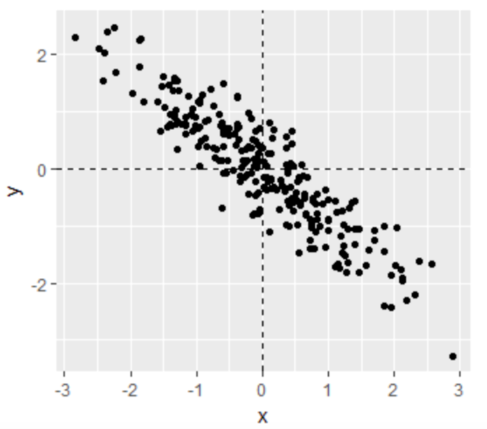
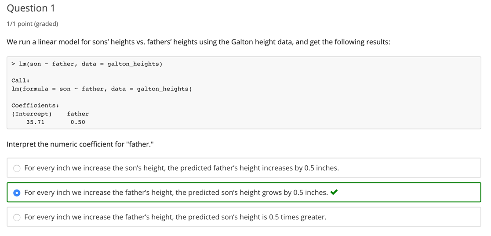
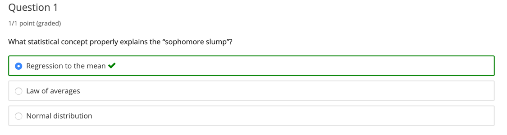
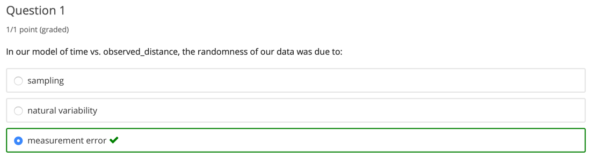

```{r setup, include=FALSE}
knitr::opts_chunk$set(echo = TRUE)
```

```{r library, message=FALSE, warning=FALSE}
library(tidyverse)
library(dslabs)
library(Lahman)
library(HistData)
library(broom)
library(gridExtra)
library(broom)
```

Linear regression is commonly used to quantify the relationship between two or more variables. It is also used to adjust for confounding. In this course, we cover how to implement linear regression and adjust for confounding in practice using R.

The class notes for this course series can be found in Professor Irizarry's freely available 
<a href="https://rafalab.github.io/dsbook/" title="Introduction to Data Science">Introduction to Data Science book.</a>

**Course overview**

There are three major sections in this course: introduction to linear regression, linear models, and
confounding.

**1. Introduction to Linear Regression**

In this section, you'll learn the basics of linear regression through this course's motivating example,
the data-driven approach used to construct baseball teams. You'll also learn about correlation, the 
correlation coefficient, stratification, and the variance explained.

**2. Linear Models**

In this section, you'll learn about linear models. You'll learn about least squares estimates, 
multivariate regression, and several useful features of R, such as tibbles, lm, do, and broom. You'll 
learn how to apply regression to baseball to build a better offensive metric.

**3. Confounding**

In the final section of the course, you'll learn about confounding and several reasons that correlation 
is not the same as causation, such as spurious correlation, outliers, reversing cause and effect, and 
confounders. You'll also learn about Simpson's Paradox.

---

# 1. Introduction to Linear Regression
In the **Introduction to Regression section**, you will learn the basics of linear regression.

After completing this section, you will be able to:

* Understand how Galton developed **linear regression**.
* Calculate and interpret the **sample correlation**.
* **Stratify** a dataset when appropriate.
* Understand what a **bivariate normal distribution** is.
* Explain what the term **variance explained** means.
* Interpret the two **regression lines**.

This section has three parts: **Baseball as a Motivating Example, Correlation**, and **Stratification and Variance Explained**. There are comprehension checks that follow most videos.

## 1.1 Baseball as a Motivating Example

### 1.1.1 Motivating Example: Moneyball
As motivation for this course, we'll go back to 2002 and try to build a baseball team with a limited 
budget. Note that in 2002, the Yankees payroll was almost \$ 130 million, and had more than tripled the 
Oakland A's \$ 40 million budget. Statistics have been used in baseball since its beginnings. Note that 
the data set we will be using, included in the **Lahman Library**, goes back to the 19th century. 
For example, a summary of statistics we will describe soon, the batting average, has been used to 
summarize a batter's success for decades. Other statistics such as home runs, runs batted in, and stolen 
bases, we'll describe all this soon, are reported for each player in the game summaries included in the 
sports section of newspapers. And players are rewarded for high numbers. 
Although summary statistics were widely used in baseball, data analysis per se was not. These statistics 
were arbitrarily decided on without much thought as to whether they actually predicted, or were related 
to helping a team win. This all changed with Bill James. In the late 1970s, this aspiring writer and 
baseball fan started publishing articles describing more in-depth analysis of baseball data. He named 
the approach of using data to predict what outcomes best predict if a team wins **sabermetrics**. 
Until Billy Beane made sabermetrics the  center of his baseball operations, Bill James' work was mostly 
ignored by the baseball world. Today,  pretty much every team uses the approach, and it has gone beyond 
baseball into other sports. In this course, to simplify the example we use, we'll focus on predicting 
scoring runs. We will ignore pitching  and fielding, although those are important as well. We will see 
how regression analysis can help develop  strategies to build a competitive baseball team with a 
constrained budget.
  
>The approach can be divided into two separate data analyses.  
>In the first, we determine which recorded player specific statistics predict runs.  
>In the second, we examine if players were undervalued based on what our first analysis predicts.

#### Question 1
What is the application of statistics and data science to baseball called?
  
* Moneyball
* **Sabermetrics**
* The "Oakland A's Approach"
* There is no specific name for this; it's just datascience.

### 1.1.2 Baseball Basics
We actually don't need to understand all the details about the game of baseball, which has over 100 
rules, to see how regression will help us find undervalued players. Here, we distill the sport to the 
basic knowledge one needs to know to effectively attack the data science challenge. Let's get started.
The goal of a baseball game is to score more runs, they're like points, than the other team. Each 
team has nine batters that bat in a predetermined order. After the ninth batter hits, we start with the 
first again. Each time they come to bat, we call it a **plate appearance, PA**. 
At each plate appearance, the other team's pitcher throws the ball and you try to hit it. The plate 
appearance ends with a binary outcome-- you either make an out, that's a failure and sit back down, or 
you don't, that's a success and you get to run around the bases and potentially score a run. Each team 
gets nine tries, referred to as innings, to score runs. Each inning ends after three outs, 
after you've failed three times. From these examples, we see how luck is involved in the process. When 
you bat you want to hit the ball hard. If you hit it hard enough, it's a home run, the best possible 
outcome as you get at least one automatic run. But sometimes, due to chance, you hit the ball very hard 
and a defender catches it, which makes it an out, a failure. In contrast, sometimes you hit the ball 
softly but it lands just in the right place. You get a hit which is a success. The fact that there is 
chance involved hints at why probability models  will be involved in all this. 
Now there are several ways to succeed. Understanding this distinction will be important for our 
analysis. When you hit the ball you want to pass as many bases as possible. There are four bases with 
the fourth one called home plate. Home plate is where you start, where you try to hit. 
So the bases form a cycle. If you get home, you score a run. We're simplifying a bit. But there are 
five ways you can succeed. In other words, not making an out.  

> 5 ways to succeed:  
> - base on balls (BB)  
> - single  
> - double (X2B)  
> - triple (X3B)  
> - home run (HR)  

First one is called a base on balls. This 
is when the pitcher does not pitch well and you get to go to first base. A single is when you hit the 
ball and you get to first base. A double is when you hit the ball and you go past first base to second. 
Triple is when you do that but get to third. And a home run is when you hit the ball and go all the way 
home and score a run. If you get to a base, you still have a chance of getting home and scoring a run if 
the next batter hits successfully. While you are on base, you can also try to steal a base. If you run 
fast enough, you can try to go from first to second or from second to third without the other team 
tagging you. All right. **Now historically, the batting average has been considered the most important 
offensive statistic**. To define this average, we define a hit and an at bat. Singles, doubles, triples, 
and home runs are hits. But remember, there's a fifth way to be successful, the base on balls. That is 
not a hit. An at bat is the number of times you either get a hit or make an out, bases on balls are 
excluded.

$$\textit{batting average} = \frac{H}{AB}$$

The batting average is simply hits divided by at bats. And it is considered the main measure 
of a success rate. Today, in today's game, this success rates ranges from player to player from 
about 20% to 38%. **We refer to the batting average in thousands**. 
So for example, if your success rate is 25% we say you're batting 250. One of Bill James' first 
important insights is that the batting average ignores bases on balls but bases on balls is a success.
So a player that gets many more bases on balls than the average player might not be recognized if he 
does not excel in batting average. But is this player not helping produce runs? No award is given to the 
player with the most bases on balls. In contrast, the total number of stolen bases are considered 
important and an award is given out to the player with the most. But players with high totals of stolen 
bases also make outs as they do not always succeed. So does a player with a high stolen base total help 
produce runs? Can we use data size to determine if it's better to pay for bases on balls or stolen bases? 
One of the challenges in this analysis is that it is not obvious how to determine if a player produces 
runs because so much depends on his teammates. We do keep track of the number of runs scored by our 
player. But note that if you hit after someone who hits many home runs, you will score many runs. But 
these runs don't necessarily happen if we hire this player but not his home run hitting teammate. 
However, we can examine team level statistics. How do teams with many stolen bases compare to teams with 
few? How about bases on balls? We  have data. Let's examine some.

#### Question 1
Which of the following outcome is not included in the batting average?
  
* A home run
* **A base on balls**
* An out
* A single

#### Question 2
Why do we consider team statistics as well as individual statistics?
  
* **The success of any individual player also depends on the strength of their team.**
* Team statistics can be easier to calculate.
* The ultimate goal of sabermatics is to rank teams, not players.


### 1.1.3 Bases on Balls or Stolen Bases
Let's start looking at some baseball data and try to answer your questions using these data. **First one, do teams that hit more home runs score more runs**? We know what the answer to this will be, but let's look at the data anyways. We're going to examine data from 1961 to 2001. We end at 2001 because, remember, we're back in 2002, getting ready to build a team. We started in 1961, because that year, the league changed from 154 games to 162 games. **The visualization of choice when exploring the relationship between two variables like home runs and runs is a scatterplot**.

```{r relationship-HR-R}
data("Teams")
ds_theme_set()
Teams %>%
  filter(yearID %in% 1961:2001) %>%
  mutate(HR_per_game = HR / G, R_per_game = R / G) %>%
  ggplot(aes(HR_per_game, R_per_game)) +
  geom_point(alpha = 0.5)
```

The following code shows you how to make that scatterplot. We start by loading the Lahman library that has all these baseball statistics. And then we simply make a scatterplot using ggplot. Here's a plot of runs per game versus home runs per game. **The plot shows a very strong association-- teams with more home runs tended to score more runs**.

```{r relationship-SB-R}
Teams %>%
  filter(yearID %in% 1961:2001) %>%
  mutate(SB_per_game = SB / G, R_per_game = R / G) %>%
  ggplot(aes(SB_per_game, R_per_game)) +
  geom_point(alpha = 0.5)
```

Now, let's examine the relationship between stolen bases and wins. Here are the runs per game plotted against stolen bases per game. **Here, the relationship is not as clear**. 

```{r relationship-BB-R}
Teams %>%
  filter(yearID %in% 1961:2001) %>%
  mutate(BB_per_game = BB / G, R_per_game = R / G) %>%
  ggplot(aes(BB_per_game, R_per_game)) +
  geom_point(alpha = 0.5)
```

Finally, let's examine the relationship between bases on balls and runs. Here are runs per game versus bases on balls per game. **Although the relationship is not as strong as it was for home runs, we do see a pretty strong relationship here**. We know that, by definition, home runs cause runs, because when you hit a home run, at least one run will score. Now it could be that home runs also cause the bases on balls. If you understand the game, you will agree with me that that could be the case. So it might appear that a base on ball is causing runs, when in fact, it's home runs that's causing both. **This is called confounding**. An important concept you will learn about. Linear regression will help us parse all this out and quantify the associations. This will then help us determine what players to recruit. Specifically, we will try to predict things like how many more runs will the team score if we increase the number of bases on balls but keep the home runs fixed. Regression will help us answer this question, as well.

#### Question 1
You want to know whether teams with more at-bats per game have more runs per game. What R code below correctly makes a scatterplot for this relationship

```{r question-1a}
Teams %>% filter(yearID %in% 1961:2001) %>%
  ggplot(aes(AB, R)) +
  geom_point(alpha = 0.5)
```

```{r question-1b}  
Teams %>% filter(yearID %in% 1961:2001) %>%
  mutate(AB_per_game = AB / G, R_per_game = R / G) %>%
  ggplot(aes(AB_per_game, R_per_game)) +
  geom_point(alpha = 0.5)
```

```{r question-1c}  
Teams %>% filter(yearID %in% 1961:2001) %>%
  mutate(AB_per_game = AB / G, R_per_game = R / G) %>%
  ggplot(aes(AB_per_game, R_per_game)) +
 geom_line()
```

```{r question-1d}  
Teams %>% filter(yearID %in% 1961:2001) %>%
  mutate(AB_per_game = AB / G, R_per_game = R / G) %>%
  ggplot(aes(R_per_game, AB_per_game)) +
  geom_point()
```
  

**Answer is B**

#### Question 2
What does the variable 'SOA' stand for in the Teams table?
Hint: make sure to use the help file (?Teams)
  
* sacrifice out
* slides or attempts
* **strikeouts by pitcher**
* accumulated singles


## 1.2 Correlation

### 1.2.1 Correlation
Up to now in this series, we have focused mainly on univariate variables. However, in data science application it is very common to be interested in the relationship between two or more variables. We saw this in our baseball example in which we were interested in the relationship, for example, between bases on balls and runs.
We'll come back to this example, but we introduce the concepts of correlation and regression using a simpler example. It is actually the dataset from which regression was born. We examine an example from genetics.
Francis Galton studied the variation and heredity of human traits. Among many other traits, Galton collected and studied height data from families to try to understand heredity. While doing this, he developed the concepts of correlation and regression, and a connection to pairs of data that follow a normal distribution. Note that, at the time this data was collected, what we know today about genetics was not yet understood. **A very specific question Galton tried to answer was, how much of a son's height can I predict with the parents height**. Note that this is similar to predicting runs with bases on balls. We have access to Galton's family data through the **HistData package**. HistData stands for historical data. 

```{r galton_heights}
galton_heights <- GaltonFamilies %>%
  filter(childNum == 1 & gender == 'male') %>%
  select(father, childHeight) %>%
  rename(son = childHeight)
```

We'll create a data set with the heights of fathers and the first sons. The actual data Galton used to discover and define regression. So we have the father and son height data. Suppose we were to summarize these data. Since both distributions are well approximated by normal distributions, we can use the two averages and two standard deviations as summaries. 

```{r galton_heights_summary}
galton_heights %>% 
  summarize(mean(father), sd(father), mean(son), sd(son))
```

Here they are. You can see the average heights for fathers is 69 inches. The standard deviation is 2.54. For sons, they're a little taller, because it's the next generation. The average height is 70.45 inches, and the standard deviation is 2.55 inches.

```{r galton_heights_plot}
galton_heights %>%
  ggplot(aes(father, son)) +
  geom_point(alpha = 0.5)
```


**However, this summary fails to describe a very important characteristic of the data that you can see in this figure**. The trend that the taller the father, the taller the son, is not described by the summary statistics of the average and the standard deviation. We will learn that the **correlation coefficient** is a summary of this trend.

#### Question 1
While studying heredity, Francis Galton developed what important statistical concept?
  
* Standard deviation
* Normal distribution
* **Correlation**
* Probability


#### Question 2
The correlation coefficient is a summary of what?
  
* **The trend between two variables**
* The dispersion of a variable
* The central tendency of a variable
* The distribution of a variable


### 1.2.2 Correlation Coefficient
The correlation coefficient is defined for a list of pairs -- $(x_1, y_1),...,(x_n, y_n)$ -- with the following formula:
$$\rho = \frac{1}{n} \sum_{i=1}^{n} \Bigg(\frac{x_i-\mu_x}{\sigma_x}\Bigg) * \Bigg(\frac{y_i-\mu_y}{\sigma_y}\Bigg)$$

Here, $\mu_x$ and $\mu_y$ are the **averages** of x and y, respectively. And $\sigma_x$ and $\sigma_y$ are the **standard deviations**. The Greek letter **rho** is commonly used in the statistics book to denote this correlation. The reason is that rho is the Greek letter for r, the first letter of the word regression. Soon, we will learn about the connection between correlation and regression. To understand why this equation does, in fact, summarize how two variables move together, consider the **i-th** entry of **x** is $x_i$ minus ${\mu_x}$ divided by $\sigma_x$ SDs away from the average. 
$$\bigg( \frac{x_i - \mu_x}{\sigma_x} \bigg) $$


Similarly, the $y_i$ -- which is paired with the $x_i$-- is $y_i$ minus $\mu_y$ divided by $\sigma_y$ SDs away from the average **y**.
$$\bigg( \frac{y_i - \mu_y}{\sigma_y} \bigg) $$

**The average (mean):**
$$\mu_x = \frac{1}{n} \sum_{i=1}^n x_i=\frac{1}{n}\big(x_1+x_2+x_3+...+x_n\big) $$

**The standard deviation (sd):**
$$\sigma_x = \frac{1}{n} \sum_{i=1}^n \sqrt{\frac{(x-\mu_x)^2}{n-1}}$$

**The variance:**
$$ variance = 2 *\sigma $$


If x and y are unrelated, then the product of these two quantities will be positive. That happens when they are both positive or when they are both negative as often as they will be negative. That happens when one is positive and the other is negative, or the other way around. One is negative and the other one is positive. This will average to about 0. The correlation is this average. And therefore, unrelated variables will have a correlation of about 0. If instead the quantities vary together, then we are averaging mostly positive products. Because they're going to be either positive times positive or negative times negative. And we get a positive correlation. If they vary in opposite directions, we get a negative correlation. Another thing to know is that we can show mathematically that the correlation is always between negative 1 and 1. To see this, consider that we can have higher correlation than when we compare a list to itself. That would be perfect correlation. 

$$\rho = \frac{1}{n} \sum_{i=1}^{n} \Bigg(\frac{x_i-\mu_x}{\sigma_x}\Bigg)^2 = \frac{1}{\sigma_x^2} \frac{1}{n} \sum_{i=1}^{n} (x_i-\mu_x)^2 = 1$$

In this case, the correlation is given by this equation, which we can show is equal to 1. A similar argument with x and its exact opposite, negative x, proves that the correlation has to be greater or equal to negative 1. So it's between minus 1 and 1. 

```{r correlation_coefficient}
galton_heights <- GaltonFamilies %>%
  filter(childNum == 1 & gender == 'male') %>%
  select(father, childHeight) %>%
  rename(son = childHeight)
galton_heights %>% summarize(cor(father, son))
```

The correlation between father and sons' height is about 0.5. You can compute that using this code. We saw what the data looks like when the correlation is 0.5. 


To see what data looks like for other values of rho, here are six examples of pairs with correlations ranging from negative 0.9 to 0.99. When the correlation is negative, we see that they go in opposite direction. As x increases, y decreases. When the correlation gets either closer to 1 or negative 1, we see the clot of points getting thinner and thinner. When the correlation is 0, we just see a big circle of points.

#### Question 1
Below is a scatterplot showing the relationship between two variables, x and y.



From this figure, the correlation between x and y appears to be about:
  
* **-0.9**
* -0.2
* 0.9
* 2


### 1.2.3 Sample Correlation is a Random Variable
Before we continue describing regression, let's go over a reminder about random variability. In most data science applications, we do not observe the population, but rather a sample. **As with the average and standard deviation, the sample correlation is the most commonly used estimate of the population correlation**. This implies that the correlation we compute and use as a summary is a **random variable**. As an illustration, let's assume that the 179 pairs of fathers and sons is our entire population.
A less fortunate geneticist can only afford to take a random sample of 25 pairs. 

```{r sample_correlation_coefficient}
set.seed(0)
R <- sample_n(galton_heights, 25, replace = TRUE) %>%
  summarize(cor(father, son))
R
```

The sample correlation for this random sample can be computed using this code. Here, the variable R is the random variable. 

```{r monte_carlo_sample_correlation_coefficient}
B <- 1000
N <- 25
R <- replicate(B,{
  R <- sample_n(galton_heights, N, replace = TRUE) %>%
    summarize(r = cor(father, son)) %>% .$r
})

data.frame(R) %>%
  ggplot(aes(R)) +
  geom_histogram(binwidth = 0.05, color ="black")

mean(R)
sd(R)
```

We can run a Monte-Carlo simulation to see the distribution of this random variable. Here, we recreate R 1000 times, and plot its histogram. We see that the expected value is the population correlation, the mean of these Rs is 0.5, and that it has a relatively high standard error relative to its size, SD 0.147. This is something to keep in mind when interpreting correlations. **It is a random variable, and it can have a pretty large standard error**. Also note that because the sample correlation is an average of independent draws, the **Central Limit Theorem** actually applies. 

$$ R \sim N \bigg(\rho,\sqrt{\frac{1-r^2}{N-2}} \bigg) $$

Therefore, for a large enough sample size N, the distribution of these Rs is approximately normal. The expected value we know is the population correlation. The standard deviation is somewhat more complex to derive, but this is the actual formula here.

```{r monte_carlo_sample_correlation_coefficient_qqplot}
qqnorm(R); qqline(R)
```

In our example, N equals to 25, does not appear to be large enough to make the approximation a good one, as we see in this qq-plot.


#### Question 1
Instead of running a Monte Carlo simulation with a sample size of 25 from our 179 father-son pairs, we now run our simulation with a sample size of 50.

Would you expect the **mean** of our sample correlation to increase, decrease, or stay approximately the same?
  
* Increase
* Decrease
* **Stay approximately the same**


#### Question 2
Instead of running a Monte Carlo simulation with a sample size of 25 from our 179 father-son pairs, we now run our simulation with a sample size of 50.

Would you expect the **standard deviation** of our sample correlation to increase, decrease, or stay approximately the same?
  
* Increase
* **Decrease**
* Stay approximately the same


## 1.3 Stratification and Variance Explained

### 1.3.1 Anscombe's Quartet/Stratification
Correlation is not always a good summary of the relationship between two variables.


A famous example used to illustrate this are the following for artificial data sets, referred to as Anscombe's quartet. All of these pairs have a correlation of 0.82. Correlation is only meaningful in a particular context. To help us understand when it is that correlation is meaningful as a summary statistic, we'll try to predict the son's height using the father's height. This will help motivate and define linear regression. We start by demonstrating how correlation can be useful for prediction. Suppose we are asked to guess the height of a randomly selected son. Because of the distribution of the son height is approximately normal, we know that the average height of 70.5 inches is a value with the highest proportion and would be the prediction with the chances of minimizing the error. But what if we are told that the father is 72 inches? Do we still guess 70.5 inches for the son? The father is taller than average, specifically he is 1.14 standard deviations taller than the average father. So shall we predict that the son is also 1.14 standard deviations taller than the average son? It turns out that this would be an overestimate. To see this, we look at all the sons with fathers who are about 72 inches. We do this by **stratifying** the father's side. We call this a **conditional average**, since we
are computing **the average son height conditioned on the father being 72 inches tall**. A challenge when using this approach in practice is that we don't have many fathers that are exactly 72. In our data set, we only have eight. If we change the number to 72.5, we would only have one father who is that height. This would result in averages with large standard errors, and they won't be useful for prediction for this reason. **But for now, what we'll do is we'll take an approach of creating strata of fathers with very similar heights**. Specifically, we will round fathers' heights to the nearest inch. This gives us the following prediction for the son of a father that is approximately 72 inches tall. We can use this code and get our answer, which is 71.84. This is 0.54 standard deviations larger than the average son, a smaller number than the 1.14 standard deviations taller that the father was above the average father. Stratification followed by box plots lets us see the distribution of each group. Here is that plot. We can see that the centers of these groups
are increasing with height, not surprisingly. The means of each group appear to follow a linear relationship. We can make that plot like this, with this code. See the plot and notice that this appears to follow a line. The slope of this line appears to be about 0.5, which happens to be the correlation between father and son heights. This is not a coincidence. To see this connection, let's plot the standardized heights against each other, son versus father, with a line that has a slope equal to the correlation. Here's the code. Here's a plot. This line is what we call the regression line. In a later video, we will describe Galton's theoretical justification for using this line to estimate conditional means. Here, we define it and compute it for the data at hand. **The regression line for two variables, x and y, tells us that for every standard deviation $\sigma_x$ increase above the average $\mu_x$. For x, y grows $\rho$ standard deviations $\sigma_y$ above the average $\mu_y$**. 

$$\bigg( \frac{y_i-\mu_y}{\sigma_y} \bigg) = \rho \bigg( \frac{x_i-\mu_x}{\sigma_x} \bigg)$$

The formula for the regression line is therefore this one. If there's perfect correlation, we predict an increase that is the same number of SDs. If there's zero correlation, then we don't use x at all for the prediction of y. For values between 0 and 1, the prediction is somewhere in between. If the correlation is negative, we predict a reduction, instead of an increase. It is because when the correlation is positive but lower than the one, that we predict something closer to the mean, that we call this regression. **The son regresses to the average height**. In fact, the title of Galton's paper was "Regression Towards Mediocrity in Hereditary Stature." 

$$y=b+mx\\slope~(m)=\rho\frac{\sigma_y}{\sigma_x} \\intercept~(b)=\mu_y-m\mu_x $$

Note that if we write this in the standard form of a line, y equals b plus mx, where b is the intercept and m is the slope, the regression line has slope rho times sigma y, divided by sigma x, and intercept mu y, minus mu x, times the slope. So if we standardize the variable so they have average 0 and standard deviation 1. Then the regression line has intercept 0 and slope equal to the correlation rho. Let's look at the original data, father son data, and add the regression line. We can compute the intercept and the slope using the formulas we just derived. Here's a code to make the plot with the regression line. If we plot the data in standard units, then, as we discussed, the regression line as intercept 0 and slope rho. Here's the code to make that plot. We started this discussion by saying that we wanted to use the conditional means to predict the heights of the sons. But then we realized that there were very few data points in each strata. When we did this approximation of rounding off the height of the fathers, we found that these conditional means appear to follow a line. And we ended up with the regression line. **So the regression line gives us the prediction**. An advantage of using the regression line is that we used all the data to estimate just two parameters, the slope and the intercept. This makes it much more stable. When we do conditional means, we had fewer data points, which made the estimates have a large standard error, and therefore be unstable. So this is going to give us a much more stable prediction using the regression line. However, are we justified in using the regression line to predict? Galton gives us the answer.

#### Question 1
Look at the figure below. The slope of the regression line in this figure is equal to what, in words?

```{r 1_3_1, echo=FALSE}
data("GaltonFamilies")

# Prepare the data set with the heights of fathers and the first son
galton_heights <- GaltonFamilies %>%
  filter(childNum == 1 & gender == 'male') %>%
  select(father, childHeight) %>%
  rename(son = childHeight)

mu_x <- mean(galton_heights$father)
mu_y <- mean(galton_heights$son)
s_x <- sd(galton_heights$father)
s_y <- sd(galton_heights$son)
r <- cor(galton_heights$father, galton_heights$son)
m <- r * (s_y / s_x)
b <- mu_y - (m * mu_x)

galton_heights %>%
  ggplot(aes(scale(father), scale(son))) + #standard units
  geom_point(alpha = 0.5) +
  geom_abline(intercept = 0, slope = r)
```

* **Slope = (correlation coefficient of son and father heights) * (standard deviation of sons’ heights / standard deviation of fathers’ heights)**  

* Slope = (correlation coefficient of son and father heights) * (standard deviation of fathers’ heights / standard deviation of sons’ heights)  

* Slope = (correlation coefficient of son and father heights) / (standard deviation of sons’ heights * standard deviation of fathers’ heights)  

* Slope = (mean height of fathers) - (correlation coefficient of son and father heights * mean height of sons).  


#### Question 2
Why does the regression line simplify to a line with intercept zero and slope $\rho$ when we standardize our x and y variables? Try the simplification on your own first!  

* When we standardize variables, both x and y will have a mean of one and a standard deviation of zero. When you substitute this into the formula for the regression line, the terms cancel out until we have the following equation: $y_i~=~\rho*x_i$  

* **When we standardize variables, both x and y will have a mean of zero and a standard deviation of one. When you substitute this into the formula for the regression line, the terms cancel out until we have the following equation: $y_i~=~\rho*x_i$**  

* When we standardize variables, both x and y will have a mean of zero and a standard deviation of one. When you substitute this into the formula for the regression line, the terms cancel out until we have the following equation: $y_i~=~\rho+x_i$


#### Question 3
What is a limitation of calculating conditional means?  
Select ALL that apply.  

* **Each stratum we condition on (e.g., a specific father’s height) may not have many data points.**  

* **Because there are limited data points for each stratum, our average values have large standard errors.**  

* **Conditional means are less stable than a regression line.**  

* Conditional means are a useful theoretical tool but cannot be calculated.  


### 1.3.2 Bivariate Normal Distribution
**Correlation and the regression line are widely used summary statistics. But it is often misused or misinterpreted**. Ascombe's example provided example of data sets in which summarizing with a correlation would be a mistake. But we also see it in the media and in scientific literature as well. **The main way we motivate the use of correlation involve what is called the bivariate normal distribution**. When a pair of random variables is approximated by a bivariate normal distribution, the scatterplot looks like ovals, like American footballs. They can be thin. That's when they have high correlation. All the way up 
to a circle shape when they have no correlation. We saw some examples previously. Here they are again. 
A more technical way to define the bivariate normal distribution is the following. First, this distribution is defined for pairs. So we have two variables, x and y. And they have paired values. They are going to be bivariate normally distributed if the following happens. If x is a normally distributed random variable, and y is also a normally distributed random variable-- and for any grouping of x that we can define, say, with x being equal to some predetermined value, which we call here in this formula little x -- then the y's in that group are approximately normal as well. If this happens, then the pair is approximately bivariate normal. When we fix x in this way, we then refer to the resulting distribution of the y's in the group -- defined by setting x in this way -- as the conditional distribution of y given x. 
$$f_{Y|X=x}~is~the~conditional~distribution\\and~E(Y|X=x)~is~the~conditional~expected~value$$

We write the notation like this for the conditional distribution and the conditional expectation. If we think the height data is well-approximated by the bivariate normal distribution, then we should see the normal approximation hold for each grouping. Here, we stratify the son height by the standardized father heights and see that the assumption appears to hold.  

```{r 1_3_2}
data("GaltonFamilies")

# Prepare the data set with the heights of fathers and the first son
galton_heights <- GaltonFamilies %>%
  filter(childNum == 1 & gender == 'male') %>%
  select(father, childHeight) %>%
  rename(son = childHeight)

# bivariate normal distribution
galton_heights %>%
  mutate(z_father = round((father - mean(father)) / sd(father))) %>%
  filter(z_father %in% -2:2) %>%
  ggplot() +
  stat_qq(aes(sample = son)) +
  facet_wrap(~z_father)
```

Here's the code that gives us the desired plot.

$$E(Y|X=x)~=~\mu_x~+~\rho~*~\frac{X~-~\mu_x}{\sigma_x}~*~\sigma_y$$

Now, we come back to defining correlation. Galton showed -- using mathematical statistics -- that when two variables follow a bivariate normal distribution, then for any given x the expected value of the y in pairs for which x is set at that value is mu y plus rho x minus mu x divided by sigma x times sigma y. 

$$\frac{E(Y|X=x)~-~\mu_y}{\sigma_x}~=~\rho~*~\frac{x~-~\mu_x}{\sigma_x}$$

Note that this is a line with slope rho times sigma y divided by sigma x and intercept mu y minus n times mu x. And therefore, this is the same as the regression line we saw in a previous video. That can be written like this.
So in summary, if our data is approximately bivariate, then the conditional expectation -- which is the best prediction for y given that we know the value of x -- is given by the regression line.  

#### Question 1
A regression line is the best prediction of Y given we know the value of X when:  

* **X and Y follow a bivariate normal distribution.**  

* Both X and Y are normally distributed.  

* Both X and Y have been standardized.  

* There are at least 25 X-Y pairs.  


### 1.3.3 Variances Explained
The theory we've been describing also tells us that the standard deviation of the conditional distribution that we described in a previous video is:  

$$Var(Y|X=x)~=~\sigma_y~*~\sqrt{1~-~\rho^2} $$

This is where statements like x explains such and such percent of the variation in y comes from. Note that the variance of y is sigma squared. That's where we start. If we condition on x, then the variance goes down to 1 minus rho squared times sigma squared y. So from there, we can compute how much the variance has gone down. It has gone down by rho squared times 100%. So the correlation and the amount of variance explained are related to each other. But it is important to remember that the variance explained statement only makes sense when the data is approximated by a bivariate normal distribution.

#### Question 1
We previously calculated that the correlation coefficient $\rho$ between fathers’ and sons’ heights is 0.5.

Given this, what percent of the variation in sons’ heights is explained by fathers’ heights? 

* 0%  

* **25%**  

* 50%  

* 75%  

When two variables follow a bivariate normal distribution, the variation explained can be calculated as: 
$$\rho^2~*~100$$


### 1.3.3 There are Two Regression Lines
We computed a regression line to predict the son's height from the father's height.
We used these calculations to get the slope and the intercept. 

```{r 1_3_3}
data("GaltonFamilies")

# Prepare the data set with the heights of fathers and the first son
galton_heights <- GaltonFamilies %>%
  filter(childNum == 1 & gender == 'male') %>%
  select(father, childHeight) %>%
  rename(son = childHeight)

# Caluclate the means, standard deviations, correlation coefficient, intercept, and the slope
mu_x <- mean(galton_heights$father)
mu_y <- mean(galton_heights$son)
s_x <- sd(galton_heights$father)
s_y <- sd(galton_heights$son)
r <- cor(galton_heights$father, galton_heights$son)
m <- r * (s_y / s_x)
b <- mu_y - (m * mu_x)
```

$$E(Y|X=x)~=~b+mx~=~35,7 + 0,5x$$

This gives us the function that the conditional expectation of y given x is 35.7 plus 0.5 times x. So, what if we wanted to predict the father's height based on the son's? 

$$x~\ne~\frac{\{E(Y|X=x)~-~b\}}{0,5}$$

It is important to know that this is not determined by computing the inverse function of what we just saw, which would be this equation here. We need to compute the expected value of x given y. 

$$E(X|Y=y)~=~b+mx~=~34,0 + 0,5y$$

This gives us another regression function altogether, with slope and intercept computed like this. So now we get that the expected value of x given y, or the expected value of the father's height given the son's height, is equal to 34 plus 0.5 y, a different regression line. 


So in summary, it's important to remember that the regression line comes from computing expectations, and these give you two different lines, depending on if you compute the expectation of y given x or x given y.

```{r 1_3_3-1}
data("GaltonFamilies")

# Prepare the data set with the heights of fathers and the first son
galton_heights <- GaltonFamilies %>%
  filter(childNum == 1 & gender == 'male') %>%
  select(father, childHeight) %>%
  rename(son = childHeight)

# Caluclate the means, standard deviations, and correlation coefficient
mu_x <- mean(galton_heights$father)
mu_y <- mean(galton_heights$son)
s_x <- sd(galton_heights$father)
s_y <- sd(galton_heights$son)
r <- cor(galton_heights$father, galton_heights$son)

# Intercept and slope of the father, given the son
m_y <- r * (s_y / s_x)
b_y <- mu_y - (m_y * mu_x)

# Intercept and slope of the son, given the father
m_x <- r * (s_x / s_y)
b_x <- mu_x - (m_x * mu_y)

# Plot
galton_heights %>%
  ggplot(aes(father, son)) +
  geom_point(alpha = 0.5) +
  geom_abline(color='blue', intercept = b_y, slope = m_y) + # Father
  geom_abline(color='green', intercept = b_x, slope = m_x)  # Son
```


# 2. Linear Models
In the **Linear Models** section, you will learn how to do linear regression.

After completing this section, you will be able to:

* Use **multivariate regression** to adjust for confounders.
* Write **linear models** to describe the relationship between two or more variables.
* Calculate the **least squares estimates** for a regression model using the **lm** function.
* Understand the differences between **tibbles** and **data frames**.
* Use the **do** function to bridge R functions and the tidyverse.
* Use the **tidy**, **glance**, and **augment** functions from the **broom** package.
* Apply linear regression to **measurement error models**.  

This section has four parts: **Introduction to Linear Models, Least Squares Estimates, Tibbles, do, and broom, and Regression and Baseball**. There are comprehension checks that follow most videos.

## 2.1 Introduction to Linear Models

### 2.1.1 Confounding: Are BBs More Predictive?
In a previous video, we found that the slope of the regression line for predicting runs from bases on balls was 0.735. 


So, does this mean that if we go and higher low salary players with many bases on balls that increases the number of walks per game by 2 for our team? Our team will score 1.47 more runs per game? We are again reminded that **ASSOCIATION IS NOT CAUSATION**. The data does provide strong evidence that a team with 2 more bases on balls per game than the average team scores 1.47 more runs per game, but this does not mean that bases on balls are the cause. If we do compute the regression line slope for singles, we get 0.449, a lower value.
Note that a single gets you to first base just like a base on ball. Those that know a little bit more about baseball will tell you that with a single, runners that are on base have a better chance of scoring than with a base on balls. So, how can base on balls be more predictive of runs? **The reason this happens is because of confounding**. 

```{r 2_1_1}
data("Teams")

Teams %>%
  filter(yearID %in% 1961:2001) %>%
  mutate(Singles = ( H - HR - X2B - X3B) / G, BB = BB / G, HR = HR / G) %>%
  summarize(cor(BB, HR), cor(Singles, HR), cor(BB, Singles))
```

Note the correlation between homeruns, bases on balls, and singles. We see that the correlation between bases on balls and homeruns is quite high compared to the other two pairs.
It turns out that pitchers, afraid of homeruns, will sometimes avoid throwing strikes to homerun hitters. **As a result, homerun hitters tend to have more bases on balls**. Thus, a team with many homeruns will also have more bases on balls than average, and as a result, it may appear that bases on balls cause runs. But it is actually the homeruns that caused the runs. In this case, we say that **bases on balls are confounded with homeruns**. But could it be that bases on balls still help? To find out, we somehow have to adjust for the homerun effect. Regression can help with this.

#### Question 1
Why is the number of home runs considered a confounder of the relationship between bases on balls and runs per game?  

* Home runs is not a confounder of this relationship.  

* Home runs are the primary cause of runs per game.  

* The correlation between home runs and runs per game is stronger than the correlation between bases on balls and runs per game.  

* **Players who get more bases on balls also tend to have more home runs; in addition, home runs increase the points per game**.    


### 2.1.2 Stratification and Multivariate Regression
To try to determine if bases on balls is still useful for creating runs, a first approach is to keep home runs fixed at a certain value and then examine the relationship between runs and bases on balls.
As we did when we stratified fathers by rounding to the closest inch, here, we can stratify home runs per game to the closest 10th. 

```{r 2_1_2}
data("Teams")

dat <- Teams %>%
  filter(yearID %in% 1961:2001) %>%
  mutate(HR_strata = round(HR / G, 1),
         BB_per_game = BB / G,
         R_per_game = R / G) %>%
  filter(HR_strata >= 0.4 & HR_strata <= 1.2)

dat %>%
  ggplot(aes(BB_per_game, R_per_game)) +
  geom_point(alpha = 0.5) +
  geom_smooth(method = "lm") +
  facet_wrap(~HR_strata)
```

We filtered our strata with few points. We use this code to generate an informative data set. And then, we can make a scatter plot for each strata. A scatterplot of runs versus bases on balls.This is what it looks like.
Remember that the regression slope for predicting runs with bases on balls when we ignore home runs was 0.735. But once we stratify by home runs, these slopes are substantially reduced. 

```{r 2_1_2-1}
dat %>%
  group_by(HR_strata) %>%
  summarize(slope = cor(BB_per_game, R_per_game) * sd(R_per_game) / sd(BB_per_game))
```

We can actually see what the slopes are by using this code. We stratify by home run and then compute the slope using the formula that we showed you previously. These values are closer to the slope we obtained from singles, which is 0.449. Which is more consistent with our intuition. Since both singles and bases on ball get us to first base, they should have about the same predictive power. Now, although our understanding of the application -- our understanding of baseball -- tells us that home runs cause bases on balls and not the other way around, we can still check if, after stratifying by base on balls, we still see a home run effect or if it goes down. 

```{r 2_1_2-2}
dat_1 <- Teams %>%
  filter(yearID %in% 1961:2001) %>%
  mutate(BB_strata = round(BB / G, 1),
         HR_per_game = HR / G,
         R_per_game = R / G) %>%
  filter(BB_strata >= 2.8 & BB_strata <= 3.9)

dat_1 %>%
  ggplot(aes(HR_per_game, R_per_game)) +
  geom_point(alpha = 0.5) +
  geom_smooth(method = "lm") +
  facet_wrap(~BB_strata)

dat_1 %>%
  group_by(BB_strata) %>%
  summarize(slope = cor(HR_per_game, R_per_game) * sd(R_per_game) / sd(HR_per_game))
```

We use the same code that we just used for bases on balls. But now, we swap home runs for bases on balls to get this plot. In this case, the slopes are the following. You can see they are all around 1.5, 1.6, 1.7. So they do not change that much from the original slope estimate, which was 1.84. Regardless, it seems that if we stratify by home runs, we have an approximately bivariate normal distribution for runs versus bases on balls.
Similarly, if we stratify by bases on balls, we have an approximately normal bivariate distribution for runs versus home runs. So what do we do? It is somewhat complex to be computing regression lines for each strata. 

$$E[R~|~BB=x_1,~HR=x_2]~=~\beta_0~+~\beta_1(x_2)x_1~+~\beta(x_1)x_2 $$

We're essentially fitting this model that you can see in this equation with the slopes for x1 changing for different values of x2 and vice versa. Here, x1 is bases on balls. And x2 are home runs. Is there an easier approach?
Note that if we take random variability into account, the estimated slopes by strata don't appear to change that much. If these slopes are in fact the same, this implies that this function beta 1 of x2 and the other function beta 2 of x1 are actually constant. 

$$E[R~|~BB=x_1,~HR=x_2]~=~\beta_0~+~\beta_1x_1~+~\beta_2x_2 $$

Which, in turn, implies that the expectation of runs condition on home runs and bases on balls can be written in this simpler model. This model implies that if the number of home runs is fixed, we observe a linear relationship between runs and bases on balls. And that the slope of that relationship does not depend on the number of home runs.
Only the slope changes as the home runs increase. The same is true if we swap home runs and bases on balls. In this analysis, referred to as **multivariate regression**, we say that the bases on balls slope beta 1 is **adjusted** for the home run effect. If this model is correct, then confounding has been accounted for. But how do we estimate beta 1 and beta 2 from the data? For this, we'll learn about linear models and least squares estimates.  

#### Question 1
As described in the video, when we stratified our regression lines for runs per game vs. bases on balls by the number of home runs, what happened?  

* **The slope of runs per game vs. bases on balls within each stratum was reduced because we removed confounding by home runs.** 

* The slope of runs per game vs. bases on balls within each stratum was reduced because there were fewer data points. 

* The slope of runs per game vs. bases on balls within each stratum increased after we removed confounding by home runs.

* The slope of runs per game vs. bases on balls within each stratum stayed about the same as the original slope.


### 2.1.3 Linear Models
Since Galton's original development, regression has become one of the most widely used tools in data science. One reason for this has to do with the fact that **regression permits us to find relationships between two variables while adjusting for others**, as we have just shown for bases on balls and home runs.
This has been particularly popular in fields where randomized experiments are hard to run,
such as economics and epidemiology. When we're not able to randomly assign each individual to a treatment or control group, confounding is particularly prevalent. For example, consider estimating the effect of any fast foods on life expectancy using data collected from a random sample of people in some jurisdiction. Fast food consumers are more likely to be smokers, drinkers, and have lower incomes. Therefore, a naive regression model may lead to an overestimate of a negative health effect of fast foods. **So how do we adjust for confounding in practice?We can use regression**.
We have described how, if data is bivariate normal, then the conditional expectation follow a regression line, that the conditional expectation as a line is not an extra assumption, but rather a result derived from the assumption, that they are approximately bivariate normal. **However, in practice it is common to explicitly write down a model that describes the relationship between two or more variables using what is called a linear model**. We know that linear here does not refer to lines exclusively, but rather to the fact that the conditional expectation is a linear combination of known quantities.
Any combination that multiplies them by a constant and then adds them up with, perhaps, a shift. 

$$ 2~+~3x~-~4y~+~5z$$

For example, 2 plus 3x minus 4y plus 5z is a linear combination of x, y, and z. 

$$\beta_0~+~\beta_1x_1~+~\beta_2x_2$$

So beta 0 plus beta 1x1, plus beta 2x 2 is a linear combination of x1 and x2. The simplest linear model is a constant beta 0. The second simplest is a line, beta 0 plus beta 1x. For Galton's data, we would denote and observe fathers' heights with x1 through xn. 

$$Y_i~=~\beta_0~+~\beta_1x_i~+~\epsilon_i,~i~=~1,\dots,N$$

Then we model end son heights we are trying to predict with the following model. Here, the little **xi's are the father's heights, which are fixed not random, due to the conditioning**. We've conditioned on these values. And then **Yi is the random son's height that we want to predict**. **We further assume that the errors that are denoted with the Greek letter for E, epsilon, epsilon i, are independent from each other, have expected value 0, and the standard deviation, which is usually called sigma, does not depend on i. It's the same for every individual. We know the xi, but to have a useful model for prediction, we need beta 0 and beta 1**.
We estimate these from the data. Once we do, we can predict the sons' heights from any father's height, x. Note that if we further assume that the epsilons are normally distributed, then this model is exactly the same one we derived earlier for the bivariate normal distribution. A somewhat nuanced difference is that in the first approach, we assumed the data was a bivariate normal, and the linear model was derived, not assumed. In practice, linear models are just assumed without necessarily assuming normality. The distribution of the epsilons is not specified. But nevertheless, if your data is bivariate normal, the linear model that we just showed holds. If your data is not bivariate normal, then you will need to have other ways of justifying the model. One reason linear models are popular is that they are **interpretable**. In the case of Galton's data, we can interpret the data like this. **Due to inherited genes, the son's height prediction grows by beta 1 for each inch we increase the father's height x**. Because not all sons with fathers of height x are of equal height, we need the term **epsilon, which explains the remaining variability**. This remaining variability includes the mother's genetic effect, environmental factors, and other biological randomness. Note that given how we wrote the model, the intercept beta 0 is not very interpretable, as it is the predicted height of a son with a father with no height. Due to regression to the mean, the prediction will usually be a bit larger than 0, which is really not very interpretable. **To make the intercept parameter more interpretable, we can rewrite the model slightly in the following way**. 

$$Y_i~=~\beta_0~+~\beta_1(x_i~-~\bar{x})~+~\epsilon_i,~i~=~1,\dots,N$$

Here, we have changed xi to xi minus the average height x bar. We have centered our covariate xi. In this case, beta 0, the intercept, would be the predicted height for the average father for the case where xi equals x bar




## 2.2 Least Squares Estimates (LSE)

### 2.2.1 Least Squares Estimates (LSE)
For linear models to be useful, we have to estimate the unknown parameters, the betas.
The standard approach in science is to find the values that minimize the distance of the fitted model to the data. To quantify this, we use the **least squares equation**.  For Galton's data, we would write something like this. 

$$RSS~=~\sum_{i=1}^{n}\{Y_i-(\beta_0+\beta_1x_i)\}^2$$

**This quantity is called the Residual Sum of Squares, RSS.**
**Once we find the values that minimize the RSS, we call the values the Least Squares Estimate, LSE**
, and denote them, in this case, with $\hat\beta_0$ hat and $\hat\beta_1$. Let's write the function that computes the RSS for any pair of values, beta 0 and beta 1, for our heights data. 


```{r 2_2_1-1}
data("GaltonFamilies")

# Prepare the data set with the heights of fathers and the first son
galton_heights <- GaltonFamilies %>%
  filter(childNum == 1 & gender == 'male') %>%
  select(father, childHeight) %>%
  rename(son = childHeight)

# RSS-function
rss <- function(beta0, beta1, data){
  resid <- galton_heights$son - (beta0 + beta1 * galton_heights$father)
  return(sum(resid^2))
}
```

It would look like this.
So for any pair of values, we get an RSS. So this is a three-dimensional plot with beta 1 and beta 2, and x and y and the RSS as a z. To find the minimum, you would have to look at this three-dimensional plot. Here, we're just going to make a two-dimensional version by keeping beta 0 fixed at 25. So it will be a function of the RSS as a function of beta 1.

```{r 2_2_1-2}
# Linear Model - Least Square Estimates
beta1 = seq(0, 1, len=nrow(galton_heights))
results <- data.frame(beta1 = beta1,
                      rss = sapply(beta1, rss, beta0 = 25))
results %>% ggplot(aes(beta1, rss)) + geom_line() + 
  geom_line(aes(beta1, rss), col=2)
```

We can use this code to produce this plot. We can see a clear minimum for beta 1 at around 0.65. So you could see how we would pick the least squares estimates. However, this minimum is for beta 1 when beta 0 is fixed at 25. But we don't know if that's the minimum for beta 0. We don't know if 25 komma 0.65 minimizes the equation across all pairs. We could use trial and error, but it's really not going to work here. Instead we will use calculus. We'll take the partial derivatives, set them equal to 0, and solve for beta 1 and beta 0. Of course, if we have many parameters, these equations can get rather complex. But there are functions in R that do these calculations for us. We will learn these soon.
To learn the mathematics behind this, you can consult the book on linear models.


### 2.2.2 The lm Function
In r, we can obtain the least squares estimates using the lm function.

$$Y_i~=~\beta_0~+~\beta_1x_i~+~\epsilon_i$$

To fit the following model where Yi is the son's height and Xi is the father height, we would write the following piece of code. 

```{r 2_2_2-1}
# LSE
fit <- lm(son ~ father, data = galton_heights)
fit
```

This gives us the least squares estimates, which we can see in the output of r. The general way we use lm is by using the tilde character to let lm know which is the value we're predicting that's on the left side of the tilde, and which variables we're using to predict-- those will be on the right side of the tilde.
The intercept is added automatically to the model.
So you don't have to include it when you write it. The object fit that we just computed includes more information about the least squares fit. We can use the function summary to extract more of this information, like this.
To understand some of the information included in this summary, we need to remember that the LSE are random variables. Mathematical statistics gives us some ideas of the distribution of these random variables. And we'll learn some of that next.


```{r 2_2_2-2}
#Question 1
data("Teams")

data_teams <- Teams %>%
  filter(yearID %in% 1961:2001) %>%
  mutate(R_per_game = R / G, BB_per_game = BB / G, HR_per_game = HR / G)

fit <-lm(R_per_game ~ BB_per_game + HR_per_game, data = data_teams)
fit
```


### 2.2.3 LSE are Random Variables
The LSE are derived from the data, Y1 through Yn, which are random. This implies that our estimates are random variables. To see this, we can run a Monte Carlo simulation in which we assume that the son and father height data that we have defines an entire population. And we're going to take random samples of size 50 and compute the regression slope coefficient for each one. 

```{r 2_2_3-1}
data("GaltonFamilies")

# Prepare the data set with the heights of fathers and the first son
galton_heights <- GaltonFamilies %>%
  filter(childNum == 1 & gender == 'male') %>%
  select(father, childHeight) %>%
  rename(son = childHeight)

# Monte-Carlo simulation and plotting them
B <- 1000
N <- 50
lse <- replicate(B,{
  sample_n(galton_heights, N, replace = TRUE) %>%
    lm(son~father, data = .) %>% .$coef
})
lse <- data.frame(beta_0 = lse[1,], beta_1 = lse[2,])

p1 <- lse %>%
  ggplot(aes(beta_0)) +
  geom_histogram(binwidth = 5, color = "black")

p2 <- lse %>%
  ggplot(aes(beta_1)) +
  geom_histogram(binwidth = 0.1, color = "black")

grid.arrange(p1, p2, ncol = 2)
```

We write this code, which gives us several estimates of the regression slope.
We can see the variability of the estimates by plotting their distribution. Here you can see the histograms of the estimated beta 0's and the estimated beta 1's. **The reason these look normal is because the central limit theorem applies here as well.For large enough N, the least squares estimates will be approximately normal with expected value beta 0 and beta 1 respectively**.
The standard errors are a bit complicated to compute, but mathematical theory does allow us to compute them, and they are included in the summary provided by the lm-function. 

```{r 2_2_3-2}
# Standard error for one simulated data set
sample_n(galton_heights, N, replace = TRUE) %>%
  lm(son~father, data = .) %>% summary
```

Here are the estimated standard errors for one of our simulated data sets. You could see them at the second column in the coefficients table. 

```{r 2_2_3-3}
# Estimated standard errors for the lse-data set(see above)
lse %>% summarize(se_0 = sd(beta_0), se_1 = sd(beta_1))
```

You can see that the standard errors estimates reported by the summary function are closed, so the standard errors that we obtain from our Monte Carlo simulation. 
The summary function also reports t-statistics --this is the t value column-- and p-values. This is the Pr bigger than absolute value of t column. The t-statistic is not actually based on the central limit theorem, but rather on the assumption that the epsilons follow a normal distribution. Under this assumption, mathematical theory tells us that the LSE divided by their standard error, which we can see here and here, follow a t distribution with N minus p degrees of freedom, with p the number of parameters in our model, which in this case is 2. The 2p values are testing the null hypothesis that beta 0 is 0 and beta 1 is 0 respectively. Note that as we described previously, for large enough N, the central limit works, and the t distribution becomes almost the same as a normal distribution.
So if either you assume the errors are normal and use the t distribution or if you assume that N is large enough to use the central limit theorem, you can construct confidence intervals for your parameters. We know here that although we will not show examples in this video, hypothesis testing for regression models is very commonly used in, for example, epidemiology and economics, to make statements such as the effect of A and B was statistically significant after adjusting for X, Y, and Z.
But it's very important to note that several assumptions -- we just described some of them-- have to hold for these statements to hold.


## 2.3 Tibbles, do, and broom

### 2.3.1 Advanced dplyr: Tibbles
Let's go back to baseball. In a previous example, we estimated the regression lines to predict runs from bases and balls in different home run strata. 

```{r 2_3_1-1}
data("Teams")

dat <- Teams %>%
  filter(yearID %in% 1961:2001) %>%
  mutate(HR_per_game = round(HR / G, 1),
         BB_per_game = BB  / G,
         R_per_game  = R / G) %>%
  select(HR_per_game, BB_per_game, R_per_game) %>%
  filter(HR_per_game >= 0.4 & HR_per_game <= 1.2)
```

We first constructed a data frame similar to this. 

```{r 2_3_1-2}
dat %>% group_by(HR_per_game) %>%
  summarize(slope = cor(BB_per_game, R_per_game) * sd(R_per_game) / sd(BB_per_game))
```

Then, to compute the regression line in each strata, since we didn't know the lm function back then, we used the formula directly like this. We argued that the slopes are similar and that the differences were perhaps due to random variation. To provide a more rigorous defense of the slopes being the same, which is what led to our multivariate regression model, we could compute confidence intervals for each slope. We have not learned the formula for this, but the lm function provides enough information to construct them. 

```{r 2_3_1-3}
# Estimated slope with function lm() - not correct
# The lm()-finction ignores the group_by()-function
dat %>% group_by(HR_per_game) %>%
  lm(R_per_game ~ BB_per_game, data = .) %>%
  .$coef
```

First, note that if we try to use the lm function to get the estimated slope like this, we don't get what we want. The lm function ignored the group_by. This is expected, because lm is not part of the tidyverse and does not know how to handle the outcome of group_by which is a group tibble.
We're going to describe tibbles in some details now. When summarize receives the output of group_by, it somehow knows which rows of the table go with which groups. But where is this information stored in the data frame? 

```{r 2_3_1-4}
# Output: Tibbles
dat %>% group_by(HR_per_game) %>% head()
```

Let's write some code to see the output of a group_by call. Note that there are no columns with the information needed to define the groups. But if you look closely at the output, you notice the line "A tibble, 6 by 3." 

```{r 2_3_1-5}
# Output: Class
dat %>% group_by(HR_per_game) %>% class()
```

We can learn the class of the return object using this line of code, and we see that the class is a "tbl." This is pronounced "tibble." It is also a tbl_df.
This is equivalent to tibble. **The tibble is a special kind of data frame**. We have seen them before, because tidyverse functions such as group_by and also summarize always return this type of data frame. The group_by function returns a special kind of tibble, the grouped tibble. We will say more about the grouped tibbles later. Note that the manipulation verbs, select, filter, mutate, and arrange, don't necessarily return tibbles. They preserve the class of the input. If they receive a regular data frame, they return a regular data frame. If they receive a tibble, they return a tibble. But tibbles are the default data frame for the tidyverse. Tibbles are very similar to data frames. You can think of them as modern versions of data frames. Next, we're going to describe briefly three important differences.


### 2.3.2 Tibbles: Differences from Data Frames
In this video, we're going to describe some of the main differences between tibbles and data frames.  

**1. Tibbles display better**  
First, the print method for tibble is much more readable than that of a data frame. To see this, type teams on your console after loading the Baseball Lahman Database. And you will see a very, very long list of columns and rows. It's barely readable. Teams is a data frame with many rows and columns. That's why you see that. Nevertheless, the output just shows everything wraps around and is hard to read. It is so bad that we don't even print it here. We'll let you print it on your own screen.

```{r 2_3_2-1}
# Tibbles display better
as.tibble(Teams)
```

Now if you convert this data frame to a tibble data frame, the output is much more readable. Here's an example.


**2. Subsets of tibbles are tibbles**  
That's the first main difference between tibbles and data frames. A second one is that if you subset the columns of a data frame, you may get back an object that is not a data frame. 

```{r 2_3_2-2}
class(Teams[,20])
```

Here's an example. If we subset the 20th column, we get back an integer. That's not a data frame. With tibbles, this is not the case. 

```{r 2_3_2-3}
class(as.tibble(Teams[,20]))
```

Here's an example. If we subset a table, we get back a table. This is useful in the tidyverse since functions require data frames as input. Now whenever you want to access the original vector that defines a column in a table, for this, you actually have to use the accessor dollar sign.

```{r 2_3_2-4}
class(as.tibble(Teams)$HR)
```

Here's an example. A related feature to this is that tibbles will give you a warning if you try to access a column that does not exist. That's not the case for data frames. For example, if we accidentally write hr in lowercase instead of uppercase, with a data frame, all we get is a no. No warning. This can make it quite hard to debug code. In contrast, if it's a tibble, and you try to access the lowercase hr column, which doesn't exist, you actually get a warning.


**3. Tibbles can have complex entries**  
A third difference is that while columns of a data frame need to be a vector of number strings or Boolean, tibbles can have more complex objects, such as lists or functions. Also note that we can create tibbles with the tibble function. 

```{r 2_3_2-5}
# Tibbles can have complex entries
tibble(id = c(1, 2, 3), func = c(mean, median, sd))
```

So, look at this line of code. We're creating a column that actually has functions in it. You can see the output here. 


**4. Tibbles can be gouped**  
Finally, the last difference we describe is that tibbles can be grouped. The function group by returns a special kind of tibble, a grouped tibble. This class stores information that lets you know which rows are in which groups. The tidyverse functions, in particular the summarize functions, are aware of the group information. In the example we showed, we saw that the on lm-function, which is not part of the tidyverse, does not know how to deal with group tibbles. The object is basically converted to a regular data frame, and then the function runs ignoring the groups. This is why we only get one pair of estimates, as we see here. To make these non-tidyverse function better integrate with a tidyverse, we will learn a new function, the function **do**.


### 2.3.3 DO
In this video, we'll describe the very useful do( ) function. The tidyverse functions know how to interpret group tibbles. Furthermore, to facilitate stringing commands through the pipe, tidyverse function consistently return data frames. Since this assures that the output of 1 is accepted as the input of another. But most our functions do not recognize group tibbles, nor do they return data frames. The lm( ) function is an example. **The do( ) function serves as a bridge between our functions, such as lm( ) and the tidyverse**. The do( ) function understands group tibbles and always returns a data
frame. So let's try to use the do( ) function to fit a regression line to each home run strata.

```{r 2_3_3-1}
data("Teams")

dat <- Teams %>%
  filter(yearID %in% 1961:2001) %>%
  mutate(HR_per_game = round(HR / G, 1),
         BB_per_game = BB  / G,
         R_per_game  = R / G) %>%
  select(HR_per_game, BB_per_game, R_per_game) %>%
  filter(HR_per_game >= 0.4 & HR_per_game <= 1.2)

dat %>%
  group_by(HR_per_game) %>%
  do(fit = lm(R_per_game ~ BB_per_game, data = .))
```

We would do it like this. Notice that we did in fact fit a regression line to each strata.
But the do( ) function would create a data frame with the first column being the strata value. And a column named fit. We chose that name. It could be any name. And that column will contain the result of the lm( ) call. Therefore, the return table has a column with lm( ) objects in the cells, which is not very useful. Also note that if we do not name a column, then do( ) will return the actual output of lm( ), not a data frame. And this will result in an error since do( ) is expecting a data frame as output. 

```
# Error, because do() expecting a data frame as output
dat %>%
  group_by(HR_per_game) %>%
  do(lm(R_per_game ~ BB_per_game, data = .))
```

If you write this, you will get the following error. For a useful data frame to be constructed, the output of the function, inside do( ), must be a data frame as well. We could build a function that returns only what you want in the form of a data frame. 

We could write for example, this function. And then we use to do( ) without naming the output, since we are already getting a data frame. 

```{r 2_3_3-3}
# Output as data frame
get_slope <- function(data){
  fit <- lm(R_per_game ~ BB_per_game, data = data)
  data.frame(slope = fit$coefficient[2],
             se = summary(fit)$coefficient[2, 2])
}

dat %>%
  group_by(HR_per_game) %>%
  do(get_slope(.))
```

We can write this very simple piece of code and now we get the expected result. We get the slope for each strata and the standard error for that slope. If we name the output, then we get a column containing the data frame. 

```{r 2_3_3-4}
# Name the output
dat %>%
  group_by(HR_per_game) %>%
  do(slope = get_slope(.))
```

So if we write this piece of code, now once again, we get one of these complex tibbles with a column having a data frame in each cell. Which is again, not very useful. All right. Now we're going to cover one last feature of do( ). If the data frame being returned has more than one row, these will be concatenated appropriately. 

```{r 2_3_3-5}
# If data frame being returned has more than more one row
get_lse <- function(data){
  fit <- lm(R_per_game ~ BB_per_game, data = data)
  data.frame(term = names(fit$coefficients),
             slope = fit$coefficient,
             se = summary(fit)$coefficient[, 2])
}

dat %>%
  group_by(HR_per_game) %>%
  do(get_lse(.))
```

Here's an example in which return both estimated parameters. The slope and intercept. We write this piece of code. And now we use the do( ) function as we used it before, and get a very useful tibble, giving us the estimates of the slope and intercept, as well as the standard errors. Now, if you think this is all a bit too complicated, you're not alone. To simplify things, we're going to introduce the **broom package**, which was designed to facilitate the use of model fitting functions such as lm( ) with the tidyverse.


### 2.3.4 Broom
The original task we ask for in a previous video was to provide an estimate and a confidence interval for the slope estimates of each strata.
The broom packs will make this quite easy. Broom has three main functions all of which
extract information from the object returned by the function LM, and return it in a tidy verse friendly data frame. These functions are **tidy, glance and augment**. The tidy function returns estimates and related information as a data frame. 

```{r 2_3_4-1}
data("Teams")

dat <- Teams %>%
  filter(yearID %in% 1961:2001) %>%
  mutate(HR_per_game = round(HR / G, 1),
         BB_per_game = BB  / G,
         R_per_game  = R / G) %>%
  select(HR_per_game, BB_per_game, R_per_game) %>%
  filter(HR_per_game >= 0.4 & HR_per_game <= 1.2)

fit <- lm(R_per_game ~ BB_per_game, data = dat)
tidy(fit)
```

Here's an example.

```{r 2_3_4-2}
# Additional important summaries
tidy(fit, conf.int = TRUE)
```

We can add other important summaries, such as confidence intervals, using arguments like this.Because the outcome is a data frame, we can immediately use it with do to string together the commands that produce the table we are after. So this piece of code will generate what we wanted to see. 

```{r 2_3_4-3}
# Outcome is a data frame , we can use do()-function
dat %>%
  group_by(HR_per_game) %>%
  do(tidy(lm(R_per_game ~ BB_per_game, data = .), conf.int = TRUE))
```

Because a data frame is returned, we can filter and select the rows and columns we want.

```{r 2_3_4-4}
# Select() and filter()
dat %>%
  group_by(HR_per_game) %>%
  do(tidy(lm(R_per_game ~ BB_per_game, data = .), conf.int = TRUE)) %>%
  filter(term == "BB_per_game") %>%
  select(HR_per_game, estimate, conf.low, conf.high)
```

So this simple piece of code gives us exactly the table we asked for. We have filtered away the intercept rows, and only show the columns we care about, the estimate and the confidence intervals. Furthermore, a table like this makes visualization with ggplot quite easy. 

```{r 2_3_4-5}
## Plot
dat %>%
  group_by(HR_per_game) %>%
  do(tidy(lm(R_per_game ~ BB_per_game, data = .), conf.int = TRUE)) %>%
  filter(term == "BB_per_game") %>%
  select(HR_per_game, estimate, conf.low, conf.high) %>%
  ggplot(aes(HR_per_game, y = estimate, ymin = conf.low, ymax = conf.high)) +
  geom_errorbar() +
  geom_point()
```

So this piece of code produces this nice plot, which provides very useful information. Now we return to discussing our original task of determining if slopes change. The plot we just made using do and broom shows that the confidence intervals overlap, which provides a nice visual confirmation that our assumption that the slopes do not change with home run strata, is relatively safe.

```{r 2_3_4-6}
## Glance() and Augement()
glance(fit)
augment(fit)
```

Earlier we mentioned two other functions from the broom package, glance and augment Glance and augment relate to model specific and observation specific outcomes, respectively.
Here we can see the model fit summary the glance returns.
You can learn more about these summaries in any regression textbook.
We'll see an example of augment in a future video.


## 2.4 Regression and Baseball

### 2.4.1 Building a Better Offensive Metric for Baseball
In trying to answer how well bases on balls predict runs, data exploration let us to this model. 

$$E[R~|~BB=x_1,HR=x_2]~=~\beta_0~+~\beta_1x_1~+~\beta_2x_2$$

Here, the data is approximately normal. And conditional distributions were also normal. Thus, we're justified to pose a linear model like this.

$$Y_i~=~\beta_0~+~\beta_1x_1~+~\beta_2x_2~+~\epsilon_i\\Y_i~=~runs~per~game\\x_1~=~BB~per~game\\x_2~=~HR~per~game$$

To use lm here, we need to let it know that we have two predictive variables. So we use the plus symbol as follows. 

```{r 2_4_1-1}
data("Teams")

fit <- Teams %>%
  filter(yearID %in% 1961:2001) %>%
  mutate(BB = BB / G, HR = HR / G, R = R / G) %>%
  lm(R ~ BB + HR, data = .)

tidy(fit, conf.int = TRUE)
```

Here's a code that fits that multiple regression model. Now, we can use the tidy function to see the nice summary. When we fit the model with only one variable without the adjustment, the estimated slopes were 0.735 and 1.844 for bases on ball and home runs, respectively.
But note that when we fit the multivariate model, both these slopes go down with the bases on ball effect decreasing much more. Now, if we want to construct a metric to pick players, we need to consider single, doubles, and triples as well. Can we build a model that predicts runs based on all these outcomes? Now, we're going to take somewhat of a leap of faith and assume that these five variables are jointly normal. This means that if we pick any one of them and hold the other for fixed, the relationship with the outcome-- in this case, runs per game-- is linear. And the slopes for this relationship do not depend on the other four values that were held constant. If this is true, if this model holds true, then a linear model for our data is the following. 

$$Y_i~=~\beta_0~+~\beta_1x_{i,1}~+~\beta_2x_{i,2}~+~\beta_3x_{i,3}~+~\beta_4x_{i,4}~+~\beta_5x_{i,5}~+~\epsilon_i$$

With x1, x2, x3, x4, x5 representing bases on balls per game, singles per game, doubles per game, triples per game, and home runs per game, respectively. 

```{r 2_4_1-2}
fit_1 <- Teams %>%
  filter(yearID %in% 1961:2001) %>%
  mutate(BB = BB / G,
         singles = (H - X2B - X3B - HR) / G,
         doubles = X2B / G,
         triples = X3B / G,
         HR = HR / G, 
         R = R / G) %>%
  lm(R ~ BB + singles + doubles + triples + HR, data = .)
coefs <- tidy(fit_1, conf.int = TRUE)
coefs
```

Using lm, we can quickly find the least square errors for the parameters using this relatively simple piece of code. We can again use the tidy function to see the coefficients, the standard errors, and confidence intervals. 

```{r 2_4_1-3}
Teams %>% 
  filter(yearID %in% 2002) %>% 
  mutate(BB = BB/G, 
         singles = (H-X2B-X3B-HR)/G, 
         doubles = X2B/G, 
         triples =X3B/G, 
         HR=HR/G,
         R=R/G)  %>% 
  mutate(R_hat = predict(fit, newdata = .)) %>%
  ggplot(aes(R_hat, R, label = teamID)) + 
  geom_point() +
  geom_text(nudge_x=0.1, cex = 2) + 
  geom_abline()
```

To see how well our metric actually predicts runs, we can predict the number of runs for each team in 2002 using the function predict to make the plot. Note that we did not use the 2002 year to create this metric. We used data from years previous to 2002. 


And here is the plot. Our model does quite a good job, as demonstrated by the fact that points from the observed versus predicted plot fall close to the identity line. So instead of using batting average or just the number of home runs as a measure for picking players, we can use our fitted model to form a more informative metric that relates more directly to run production. Specifically, to define a metric for player A, we imagine a team made up of players just like player A and use our fitted a regression model to predict how many runs this team would produce. 


The formula would look like this. We're basically sticking in the estimated coefficients into the regression formula. However, to define a player's specific metric, we have a bit more work to do. Our challenge here is that we have derived the metrics for teams based on team-level summary statistics. For example, the home run value that is entered into the equation is home runs per game for the entire team. If you compute the home runs per game for a player, it will be much lower. As the total is accumulated by nine batters, not just one. Furthermore, if a player only plays part of the game and gets less opportunity than average, it's still considered a game play. So this means that their rates will be lower than they should be. For players, a rate that takes into account opportunities is a **per-plate-appearance rate**. 

```{r 2_4_1-4}
pa_per_game <- Batting %>%
  filter(yearID == 2002) %>%
  group_by(teamID) %>%
  summarize(pa_per_game = sum(AB + BB) / max(G)) %>%
  .$pa_per_game %>%
  mean
```

To make the per-game team rate comparable to the per-plate-appearance player rate, we compute the average number of team plate appearances per game using this simple piece of code. Now, we're ready to use our metric. We're going to compute the per-plate-appearance rates for players available in 2002. But we're going to use data from 1999 2001. Because remember, we are picking players in 2002. We don't know what has happened yet. To avoid small sample artifacts, we're going to filter players with few plate interferences. 
```{r 2_4_1-5}
players <- Batting %>% filter(yearID %in% 1999:2001) %>% 
  group_by(playerID) %>%
  mutate(PA = BB + AB) %>%
  summarize(G = sum(PA)/pa_per_game,
            BB = sum(BB)/G,
            singles = sum(H-X2B-X3B-HR)/G,
            doubles = sum(X2B)/G, 
            triples = sum(X3B)/G, 
            HR = sum(HR)/G,
            AVG = sum(H)/sum(AB),
            PA = sum(PA)) %>%
  filter(PA >= 300) %>%
  select(-G) %>%
  mutate(R_hat = predict(fit, newdata = .))
players %>% ggplot(aes(R_hat)) + 
  geom_histogram(binwidth = 0.5, color = "black")
```

Here is the calculation of what we want to do in one long line of code using tidyverse. So we fit our model. And we have player-specific metrics. The player-specific predicted runs computer here can be interpreted as a number of runs we would predict a team to score if this team was made up of just that player, if that player batted every single time. The distribution shows that there's y variability across players, as we can see here. To actually build the teams, we will need to know the players' salaries, since we have a limited budget. Remember, we are pretending to be the Oakland A's in 2002 with only a $\$$40 million budget. We also need to know the players' position. Because we're going to need one shortstop, one second baseman, one third baseman, et cetera. For this, we're going to have to do a little bit of data wrangling to combine information that is contained in different tables from the Lahman library. OK, so here we go. 

```{r 2_4_1-6}
players <- Salaries %>%
  filter(yearID == 2002) %>%
  select(playerID, salary) %>%
  right_join(players, by = 'playerID')
```

We start by adding the 2002 salaries for each player using this code. Next, we're going to add the defensive position. This is a little bit complicated, because players play more than one position each year. So here, we're going to pick the one position most played by each player using the top_n function. And to make sure that we only pick one position in the case of ties, we're going to take the first row if there is a tie. We also remove the OF position. Because this stands for outfielder, which is a generalization of three positions-- left field, center field, right field. We also remove pitchers, as they don't bat in the league that the Athletics play. 

```{r 2_4_1-7}
players <- Fielding %>%
  filter(!POS %in% c("OF", "P"))%>%
  group_by(playerID) %>%
  top_n(1, G) %>%
  filter(row_number(G) == 1) %>%
  ungroup() %>%
  select(playerID, POS) %>%
  right_join(players, by = "playerID")
players %>% filter(!is.na(POS) & !is.na(salary))
```

Here is the code that does that. 

```{r 2_4_1-8}
players <- Master %>%
  select(playerID, nameFirst, nameLast, debut) %>%
  right_join(players, by = "playerID")
```

Finally, we add their names and last names so we know who we're talking about. And here's a code that does that. 

```{r 2_4_1-9}
players %>% 
  select(nameFirst, nameLast, POS, salary, R_hat) %>%
  arrange(desc(R_hat)) %>%
  top_n(10)
```

So now, we have a table with our predicted run statistic, some other statistic, the player's name, their position, and their salary. If we look at the top 10 players based on our run production statistic, you're going to recognize some names if you're a baseball fan. Note the very high salaries of these players in the top 10. In fact, we see that players with high metrics have high salaries. 

```{r 2_4_1-10}
players %>%
  ggplot(aes(salary, R_hat, color = POS)) +
  geom_point() +
  scale_x_log10()
```


We can see that by making a plot we do see some low-cost players with very high metrics. These would be great for our team. Unfortunately, these are likely young players that have not yet been able to negotiate a salary and are not going to be available in 2002. For example, the lowest earner on our top 10 list is Albert Pujols, who was a rookie in 2001. 

```{r 2_4_1-11}
players %>%
  filter(debut < 1998) %>%
  ggplot(aes(salary, R_hat, color = POS)) +
  geom_point() +
  scale_x_log10()
```

Here's a plot with players that debuted before 1997. This removes all the young players. We can now search for good deals by looking at players that produce many more runs and others with similar salaries. We can use this table to decide what players to pick and keep our total salary below the $40 million Billy Beane had to work with.


### 2.4.2 On Base Plus Slugging (OPS)
Since the 1980s sabermetricians have used a summary statistic different from batting average to evaluate players. They realized walks were important, and that doubles, triples, and home runs should be weighted much more than singles, and proposed the following metric. 


They call this on-base-percentage plus slugging percentage, or OPS. Today, this statistic has caught on, and you see it in ESPN and other sports networks. Although the sabermetricians are probably not using regression, this metric is impressively close to what one gets with regression to the summary statistic that we created. 


Here is the plot. They're very correlated.


### 2.4.3 Regression Fallacy
Wikipedia defines the sophomore slump in the following way. A sophomore slump or sophomore jinx or sophomore jitters refers to an instance in which a second, or sophomore, effort fails to live up to the standard of the first effort.It is commonly used to refer to the apathy of students-- second year of high school, college, university-- the performance of athletes-- second season of play-- singers/bands-- second album-- television shows-- second season-- and movies-- sequels or prequels.
We hear about the sophomore slump often in Major League Baseball. This is because in Major League Baseball, the Rookie of the Year-- this is an award that's given to the first year player that is judged to have performed the best-- usually does not perform as well during their second year. Therefore they call this the sophomore slump.Know, for example, that in a recent Fox Sports article they asked, will MLB's tremendous rookie class of 2015 suffer a sophomore slump. Now does the data confirm the existence of a sophomore slump?
Let's take a look and examine the data for batting averages to see if the observation holds true. The data is available in the Lahman library but we have to do some work to create a table with the statistics for all the rookies of the year.

```{r 2_4_3-1}
playerInfo <- Fielding %>%
  group_by(playerID) %>%
  arrange(desc(G)) %>%
  slice(1) %>%
  ungroup %>%
  left_join(Master, by = "playerID") %>%
  select(playerID, nameFirst, nameLast, POS)
head(playerInfo)
```

Let's go through them. First, we create a table with player ID, their names and their most
played position, using this code. Now we will create a table with only the Rookie of the Year Award winners and add their batting statistics. We're going to filter out pitchers since pitchers are not given awards for batting.And we're going to focus on offense. Specifically, we'll focus on batting average since it is the summary that most pundits talk about when discussing the sophomore slump. 

```{r 2_4_3-2}
ROY <- AwardsPlayers %>%
  filter(awardID == "Rookie of the Year") %>%
  left_join(playerInfo, by = "playerID") %>%
  rename(rookie_year = yearID) %>%
  right_join(Batting, by = "playerID") %>%
  mutate(AVG = H / AB) %>%
  filter(POS != "P")
head(ROY)
```

So we write this piece of code to do this. 

```{r 2_4_3-3}
ROY <- ROY %>%
  filter(yearID == rookie_year | yearID == rookie_year + 1) %>%
  group_by(playerID) %>%
  mutate(rookie = ifelse(yearID == min(yearID), "rookie", "sophomore")) %>%
  filter(n() == 2) %>%
  ungroup() %>%
  select(playerID, rookie_year, rookie, nameFirst, nameLast, AVG)
head(ROY)
```

Now we'll keep only the rookie and sophomore seasons and remove players that did not play a sophomore season. And remember, now we're only looking at players that won the Rookie of the Year Award. This code achieves what we want.

```{r 2_4_3-4}
ROY <- ROY %>%
  spread(rookie, AVG) %>%
  arrange(desc(rookie))
head(ROY)
```

Finally, we will use the spread function to have one column for the rookie and another column for the sophomore years' batting averages. For that we use this simple line of code. Now we can see the top performers in their first year. These are the Rookie of the Year Award winners. And we're showing their rookie season batting average and their sophomore season batting average. Look closely and you will see the sophomore slump. It definitely appears to be real. In fact, the proportion of players that have a lower batting average their sophomore years is 68%.

So is it jitters? Is it a jinx? To answer this question, let's turn our attention to all players. We're going to look at the 2013 season and 2014 season. And we're going to look at players that batted at least 130 times. This is a minimum needed to win the Rookie of the Year. We're going to perform a similar operation as we did before to construct this data set. 

```{r 2_4_3-5}
two_years <- Batting %>% 
  filter(yearID %in% 2013:2014) %>% 
  group_by(playerID, yearID) %>%  
  filter(sum(AB) >= 130) %>% 
  summarize(AVG = sum(H)/sum(AB)) %>% 
  ungroup %>% 
  spread(yearID, AVG) %>% 
  filter(!is.na(`2013`) & !is.na(`2014`)) %>%
  left_join(playerInfo, by = "playerID") %>%
  filter(POS!="P") %>% 
  select(-POS) %>%
  arrange(desc(`2013`)) %>% 
  select(-playerID)
head(two_years)
```

Here is the code.Now let's look at the top performers of 2013 and then look at their performance in 2014. Note that the same pattern arises when we look at the top performers. Batting averages go down for the top performers. But these are not rookies. So this can't be explained with a sophomore slump. Also note what happens to the worst performers of 2013. 

```{r 2_4_3-6}
arrange(two_years, `2013`)
```

Here they are. Their batting averages go up in their second season in 2014. Is this some sort of reverse sophomore slump? It is not. There is no such thing as a sophomore slump. This is all explained with a simple statistical fact.
**The correlation of performance in two separate years is high but not perfect**. 

```{r 2_4_3-7}
two_years %>%
  ggplot(aes(`2013`, `2014`)) +
  geom_point()
```

Here is the data for 2013 performance and 2014 performance. You can see it's correlated. But it's not perfectly correlated. 

```{r 2_4_3-8}
summarize(two_years, cor(`2013`, `2014`))
```

The correlation is 0.46. The data look very much like a bivariate normal distribution, which means that if we were to predict the 2014 batting average, let's call it y, for any given player that had a 2013 batting average of x, we would use the regression equation, which would be this.

$$ \frac{Y - .255}{.032} = 0.46 \left( \frac{X - .261}{.023}\right) $$

Because a correlation is not perfect, regression tells us that on average, we expect high performers from 2013 to do a little bit worse in 2014. This regression to the mean.
It's not a jinx. It's just due to chance. The rookies of the year are selected from the top values of x So it is expected that their y will regress to the mean.




### 2.4.4 Measurement Error Models
Up until now, all our linear regression examples have been applied to two or more random variables. We assume the pairs are bivariate normal and use this to motivate a linear model. This approach covers most of real life examples where linear regression is used. **The other major application comes from measurement error models**. In these applications, it is common to have a nonrandom covariates, such as time. And randomness is introduced from measurement error, rather than sampling or natural variability. To understand these models, we're going to use a motivation example related to physics. Imagine you are Galileo in the 16th century trying to describe the velocity of a falling object. An assistant climbs the Tower of Pisa and drops a ball. While several other assistants record the position at different times. **The falling object data set contains an example of what that data would look like**. 

```{r 2_4_4-1}
falling_object <- rfalling_object()
falling_object

falling_object %>% 
  ggplot(aes(time, observed_distance)) + 
  geom_point() +
  ylab("Distance in meters") + 
  xlab("Time in seconds")
```

The assistant hands the data to Galileo and this is what he sees. He uses ggplot to make a plot. Here we see the distance in meters that has dropped on the y-axis and time on the x-axis. Galileo does not know the exact equation, but from data exploration, by looking at the plot, he deduces that the position should follow a **parabola**, which we can write like this.

$$ f(x) = \beta_0 + \beta_1 x + \beta_2 x^2$$

The data does not fall exactly on a parabola, but Galileo knows that this is due to measurement error. His helpers make mistakes when measuring the distance the ball has fallen. To account for this, we write this model. 

$$ Y_i = \beta_0 + \beta_1 x_i + \beta_2 x_i^2 + \varepsilon_i, i=1,\dots,n $$

Here, y represents the distance the ball is dropped in meters. Xi represents time in seconds. And epsilon represents measurement error. The measurement error is assumed to be random, independent from each other and having the same distribution from each eye. We also assume that there is no bias, which means that the expected value of epsilon is 0. 

$$ E[\epsilon]=0$$

Note that this is a linear model because it is a linear combination of known quantities. X and x squared are known and unknown parameters, the betas. Unlike our previous example, the x's are fixed quantities. This is just time. We're not conditioning. Now to pose a new physical theory and start making predictions about other falling objects, Galileo needs actual numbers, rather than the unknown parameters. The LSE squares estimates seem like a reasonable approach. So how do we find the LSE squares estimates? Note that the LSE calculations do not require the errors to be approximately normal. The lm( ) function will find the betas that minimize the residual sum of squares, which is what we want. 

```{r 2_4_4-2}
fit <- falling_object %>% 
  mutate(time_sq = time^2) %>% 
  lm(observed_distance~time+time_sq, data=.)
tidy(fit)
```

So we use this code to obtain our estimated parameters. To check if the estimated parabola fits the data, the broom function augment( ) lets us do this easily. 

```{r 2_4_4-3}
augment(fit) %>% 
  ggplot() +
  geom_point(aes(time, observed_distance)) + 
  geom_line(aes(time, .fitted), col = "blue")
```

Using this code, we can make the following plot. Note that the predicted values go right through the points. Now, thanks to my high school physics teacher, I know that the equation for the trajectory of a falling object is the following. 

$$d = h_0 + v_0 t -  0.5 \times 9.8 t^2$$

With h0 and v0, the starting height and starting velocity respectively. The data we use follow this equation and added measurement error to simulate and observations. Dropping the ball, that means the starting velocity is 0 because we start just by dropping it from the Tower of Pisa, which has a height of about 56.67 meters. These known quantities are consistent with the parameters that we estimated, which we can see using the tidy function. 

```{r 2_4_4-4}
tidy(fit, conf.int = TRUE)
```

Here they are. The Tower of Pisa height is within the confidence interval for beta 0. The initial velocity of 0 is in the confidence interval for beta 1. Note that the p value is larger than 0.05, which means we wouldn't reject the hypothesis that the starting velocity is 0. And finally, the acceleration constant is in the confidence intervals for negative 2 times beta 2.




# 3. Confounding
In the **Confounding section**, you will learn what is perhaps the most important lesson of statistics: that correlation is not causation.

After completing this section, you will be able to:

* Identify examples of **spurious correlation** and explain how **data dredging** can lead to spurious correlation.
* Explain how **outliers** can drive correlation and learn to adjust for outliers using **Spearman correlation**.
* Explain how **reversing cause and effect** can lead to associations being confused with causation.
* Understand how **confounders** can lead to the misinterpretation of associations.
* Explain and give examples of **Simpson's Paradox**.  

This section has one part: **Correlation is Not Causation**. There are comprehension checks that follow most videos.

## 3.1 Correlation is Not Causation

### 3.1.1 Spurious Correlation
**Association is not causation** is perhaps the most important lesson one learns in a statistics class. **Correlation is not causation** is another way to say this.

In this course, we have described tools useful for quantifying associations between variables, but we must be careful not to over interpret these associations. There are many reasons that a variable x can correlate with a variable y, without either being a cause for the other. Here we examine common ways that can lead to misinterpreting associations. **The first example of how we can misinterpret associations are spurious correlations**. The following comical example underscores that correlation is not causation. 


The example shows a very strong correlation between divorce rates and margarine consumption. The correlation is 0.93. Does this mean that margarine causes divorces, or do divorces cause people to eat more margarine? Of course, the answer to both these questions is no. This is just an example of what we call spurious correlations. 

[Spurious Correlations](http://tylervigen.com/spurious-correlations)

You can see many, many more observed examples in this website completely dedicated to spurious correlations. In fact, that's the title of the website. The cases presented in the spurious correlation site are all examples of what is generally called **data dredging, or data phishing, or data snooping**. It's basically a form of what in the United States, they call **cherry picking**.
An example of data dredging would be if you look through many results produced by a random process, and pick the one that shows a relationship that supports the theory you want to defend. A Monte Carlo simulation can be used to show how data dredging can result in finding high correlations among variables that are theoretically uncorrelated. 

```{r 3_1_1-1}
N <- 25
G <- 1000000
sim_data <- tibble(group = rep(1:G, each = N), X = rnorm(N*G), Y = rnorm(N*G))
```

We'll save the results of a simulation into a table like this. The first column denotes group and we simulated one million groups, each with 25 observations. For each group, we generate 25 observations which are stored in the second and third column. These are just random, independent normally distributed data. So we know, because we constructed the simulation, **that x and y are not correlated**.

```{r 3_1_1-2}
res <- sim_data %>% 
  group_by(group) %>% 
  summarize(r = cor(X, Y)) %>% 
  arrange(desc(r))
head(res)
```

Next, we compute the correlation between x and y for each group, and look for the maximum. Here are the top correlations. 

```{r 3_1_1-3}
sim_data %>% filter(group == res$group[which.max(res$r)]) %>%
  ggplot(aes(X, Y)) +
  geom_point() + 
  geom_smooth(method = "lm")
```

If we just plot the data from this particular group, it shows a convincing plot that x and y are, in fact, correlated. But remember that the correlations number is a random variable. 

```{r 3_1_1-4}
res %>% ggplot(aes(x=r)) + geom_histogram(binwidth = 0.1, color = "black")
```

Here's the distribution we just generated with our Monte Carlo simulation.  
It is just a mathematical fact that if we observe random correlations that are expected to be 0, but have a standard error of about 0.2, the largest one will be close to 1 if we pick from among one million. Note that if we performed regression on this group and interpreted the p-value, we would incorrectly claim this was a statistically significant relation. 

```{r 3_1_1-5}
sim_data %>% 
  filter(group == res$group[which.max(res$r)]) %>%
  do(tidy(lm(Y ~ X, data = .)))
```

Here's the code. Look how small the p-value is. This particular form of data dredging is referred to as **p-hacking**. P-hacking is a topic of much discussion because it is a problem in scientific publications. Because publishers tend to reward statistically significant results over negative results, there's an incentive to report significant results. In epidemiology in the social sciences for example, researchers may look for associations between an average outcome and several exposures, and report only the one exposure that resulted in a small p-value. Furthermore, they might try fitting several different models to adjust for confounding and pick the one model that yields the smallest p-value. In experimental disciplines, an experiment might be repeated more than once, and only the one that results in a small p-value are reported. This does not necessarily happen due to unethical behaviour, but rather to statistical ignorance or wishful thinking. In advanced statistics courses, you'll learn methods to adjust for what is called the **multiple comparison problem**.


### 3.1.2 Outliers
Another way that we can see high correlations when there'sno causation is when we have **outliers**.  
Suppose we take measurements from two independent outcomes, x and y, and we standardize the measurements. However, imagine we made a mistake and forgot to standardize entry 23. 

```{r 3_1_2-1}
set.seed(1)
x <- rnorm(100,100,1)
y <- rnorm(100,84,1)
x[-23] <- scale(x[-23])
y[-23] <- scale(y[-23])
tibble(x,y) %>% ggplot(aes(x,y)) + geom_point(alpha = 0.5)
```

We can simulate such data using the following code. The data looks like this. 

```{r 3_1_2-2}
cor(x,y)
```

Not surprisingly, the correlation is very high. That one point, that one outlier, is making the correlation be as high as 0.99. But again, this is driven by that one outlier. If we remove this outlier, the correlation is greatly reduced to almost 0, which is what it should be. 

```{r 3_1_2-3}
cor(x[-23], y[-23])
```

Here's what we get if we remove entry 23. So one way to deal with outliers is to try to detect them and remove them. But there is an alternative way to the sample correlation for estimating the population correlation that is robust to outliers.It is called **Spearman correlation**. The idea is simple. **Compute the correlation on the ranks of the values, rather than the values themselves**. 

```{r 3_1_2-4}
tibble(x,y) %>% 
  ggplot(aes(rank(x),rank(y))) + 
  geom_point(alpha = 0.5)
```

Here's a plot of the ranks plotted against each other for that data set that includes the outlier. Note that the one point that's very large is just at the 100th location. It is no longer really out there and pulling the correlation towards 1. 

```{r 3_1_2-5}
cor(rank(x), rank(y))
```

So if we compute the correlation of the ranks, we get something much closer to 0, as we see here. 

```{r 3_1_2-6}
cor(x, y, method = "spearman")
```

Spearman correlation can also be calculated with the correlation function, but using the method argument to tell **cor** which correlation to compute.


### 3.1.3 Reversing Cause and Effect
Another way associations are confounded with causation is when the **cause and effect are reversed**.  
An example of this is claiming that tutoring makes students perform worse because they test lower than peers that are not tutored. Here, the tutoring is not causing the low test, but the other way around. 

[Parental Involvement Is Overrated](https://opinionator.blogs.nytimes.com/2014/04/12/parental-involvement-is-overrated/?rref=opinion&module=ArrowsNav&contentCollection=Opinion&action=keypress&region=FixedLeft&pgtype=Blogs)

A form of this claim was actually made in an op ed in the New York Times, titled "Parental Involvement is Overrated". Consider this quote from the article. "When we examine whether regular help with homework had a positive impact on children's academic performance, we were quite startled by what we found. Regardless of family social class, racial, or ethnic background, or child's grade level, consistent homework help almost never improved test scores or grades. Even more surprising to us was that when parents regularly helped with homework, kids usually performed worse." A very likely possibility is that children needing regular parental help get this help because they don't perform well in school. To see another example, we're going to use one of the data sets that we've seen in this course. Specifically, we can easily construct an example of cause and effect reversal using the father and son height data. 

$$X_i = \beta_0 + \beta_1 y_i + \varepsilon_i, i=1, \dots, N$$

Note that if we fit the following model to the father and son height data, with x representing the father height, and y representing the son height, we do get a statistically significant result. 

```{r 3_1_3-1}
data("GaltonFamilies")
GaltonFamilies %>%
  filter(childNum == 1 & gender == "male") %>%
  select(father, childHeight) %>%
  rename(son = childHeight) %>% 
  do(tidy(lm(father ~ son, data = .)))
```

You can see that with this simple code. This model fits the data very well. However, if we look at the mathematical formulation of the model, it could easily be incorrectly interpreted as to suggest that the son being tall caused the father to be tall. But given what we know about genetics and biology, we know it's the other way around. The model is technically correct. The estimates and p-value were obtained correctly as well. What is wrong here is simply the interpretation.


### 3.1.4 Confounders
**Confounders** are perhaps the most common reason that leads to associations being misinterpreted.  
**If X and Y are correlated, we call Z a confounder if changes in Z cause changes in both X and Y**.  

Earlier, when studying baseball data, we saw how home runs was a confounder that resulted in higher correlation than expected when studying the relationship between bases and balls and runs. In some cases, we can use linear models to account for confounders, as we did in the baseball example. But it is not always possible. Incorrect interpretation due to confounders are ubiquitous in the lay press. They are sometimes hard to detect. We examined admission data from UC Berkeley majors from 1973 that showed that more men were being admitted than women. 44% men were admitted compared to 30% women.

```{r 3_1_4-1}
data(admissions)
admissions
```

Here's the data.

```{r 3_1_4-2}
admissions %>% group_by(gender) %>% 
  summarize(percentage = 
              round(sum(admitted*applicants)/sum(applicants),1))
```

The percent of men and women that got accepted can be computed from this data using this simple piece of code. 

```{r 3_1_4-3}
admissions %>% group_by(gender) %>% 
  summarize(total_admitted = round(sum(admitted/100*applicants)), 
            not_admitted = sum(applicants) - sum(total_admitted)) %>%
  select(-gender) %>% 
  do(tidy(chisq.test(.)))
```

A statistical test, the chi-squared test that we learned about in a previous course, clearly rejects the hypothesis that gender and admissions are independent. The p value is very small. But closer inspection shows a paradoxical result. 

```{r 3_1_4-4}
admissions %>% select(major, gender, admitted) %>%
  spread(gender, admitted) %>%
  mutate(women_minus_men = women - men)
```

Here are the percent of admissions by major. Four out of the six majors favour women.
But more importantly, all the differences are much smaller than the 14% difference that we see when examining the totals. The paradox is that analyzing the totals suggest a dependence between admissions and gender.
But when the data is grouped by major, this dependence seems to disappear. What's going on? This actually can happen if an uncounted confounder is driving most of the variability. So let's define three variables. X is 1 for men and 0 for women, Y is 1 for those admitted and 0 otherwise, and Z quantifies how selective the major is. 

$$\mbox{Pr}(Y=1 | X = x)$$

A gender bias claim would be based on the fact that this probability is higher when X is 1 than when X is 0. But Z is an important confounder. Clearly, Z is associated with Y, because the more selective a major, the lower the probability that someone enters that major. But is major selectivity, which we call Z, associated with gender? One way to see this is to plot the total percent admitted to a major versus the percent of women that make up the applicants. 

```{r 3_1_4-5}
admissions %>% 
  group_by(major) %>% 
  summarize(major_selectivity = sum(admitted*applicants)/sum(applicants),
            percent_women_applicants = sum(applicants*(gender=="women")/sum(applicants))*100) %>%
  ggplot(aes(major_selectivity, percent_women_applicants, label = major)) +
  geom_text()
```

We can see that in this plot. There seems to be an association. The plot suggests that women were much more likely to apply to the two hard majors. Gender and major selectivity are confounded. Compare, for example, major B and major E. Major E is much harder to enter than major B. And over 60% of applicants to major E were women, while less than 30% of the applicants of major B were women. 

```{r 3_1_4-6}
admissions %>% 
  mutate(percent_admitted = admitted*applicants/sum(applicants)) %>%
  ggplot(aes(gender, y = percent_admitted, fill = major)) +
  geom_bar(stat = "identity", position = "stack")
```

The following plot shows the percentage of applicants that were accepted by gender. The color here represents major. It also breaks down the acceptance rates by major. The size of the colored bar represent the percent of each major students that were admitted to. This breakdown lets us see that the majority of accepted men came from two majors, A and B. It also lets us see that few women apply to these two easy majors. What the plot does not show us is what's the percent admitted by major. 

```{r 3_1_4-7}
admissions %>% 
  ggplot(aes(major, admitted, col = gender, size = applicants)) +
  geom_point()
```

In this plot, we can see that if we condition or stratify by major, and then look at differences, we control for the confounder, and the effect goes away.Now we see that major by major, there's not much difference. The size of the dot represents the number of applicants, and explains the paradox. We see large red dots and small blue dots for the easiest majors, A and B. 

```{r 3_1_4-8}
admissions %>%  group_by(gender) %>% summarize(average = mean(admitted))
```

If we first stratify by major, compute the difference, and then average, we find that the percent difference is actually quite small. This is actually an example of something that is called **Simpson's paradox**, which we will describe in the next video.


### 3.1.4 Simpson's Paradox
We have just seen an example of Simpson's paradox. It is called a paradox because we see the sign of the correlation flip when we computed on the entire population and when we computed on specific strata.  
Now, we're going to use a very illustrative simulated example to show you how this can happen. Suppose you have three variables-- x, y, and z. 

```{r 3_1_5-1}
N <- 100
Sigma <- matrix(c(1,0.75,0.75, 1), 2, 2)*1.5
means <- list(c(11,3), c(9,5), c(7,7), c(5,9), c(3,11))
dat <- lapply(means, function(mu) 
  MASS::mvrnorm(N, mu, Sigma))
dat <- tbl_df(Reduce(rbind, dat)) %>% 
  mutate(Z = as.character(rep(seq_along(means), each = N)))
names(dat) <- c("X", "Y", "Z")
dat %>% ggplot(aes(X,Y)) + geom_point(alpha = .5) +
  ggtitle(paste("correlation = ", round(cor(dat$X, dat$Y), 2)))
```

Here's a scatter plot of y versus x. You can see that x and y are negatively correlated. However, once we stratify by z-- the confounder which we haven't looked at yet-- we see that another pattern emerges. 

```{r 3_1_5-2}
means <- tbl_df(Reduce(rbind, means)) %>% setNames(c("x","y")) %>%
  mutate(z = as.character(seq_along(means)))
corrs <- dat %>% group_by(Z) %>% summarize(cor = cor(X,Y)) %>% .$cor 
dat %>% ggplot(aes(X, Y, color = Z)) + 
  geom_point(show.legend = FALSE, alpha = 0.5) +
  ggtitle(paste("correlations =",  paste(signif(corrs,2), collapse=" "))) +
  annotate("text", x = means$x, y = means$y, label = paste("Z=", means$z), cex = 5)  
```

This plot, the different strata defined by disease, are shown in different colors. If you compute the correlation in each strata, you see that the correlations are now positive. So it's really z that is negatively correlated with x. If we stratify by z, the x and y are actually positively correlated. This is an example of Simpson's paradox.


